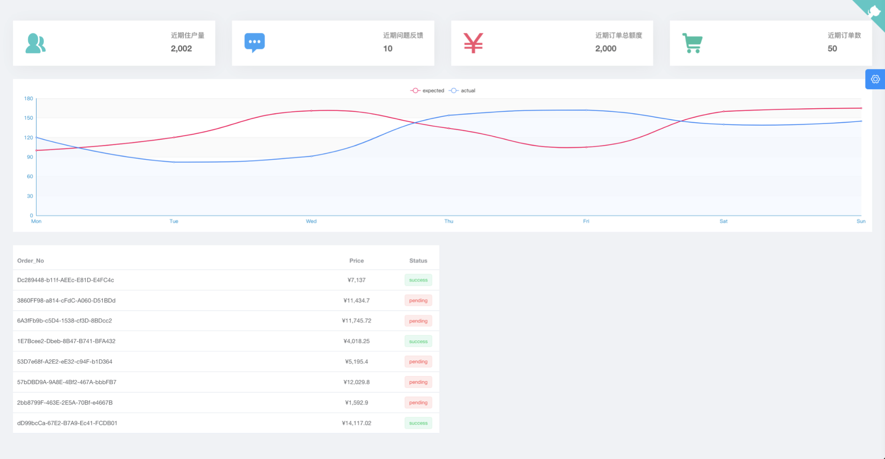
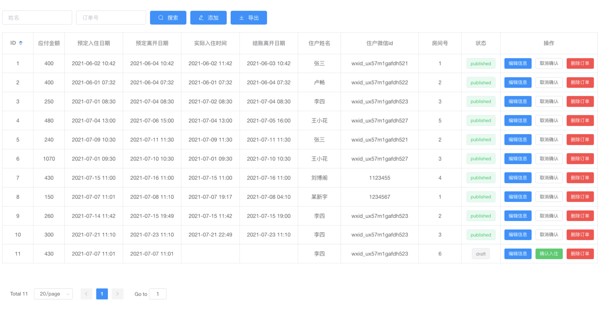

# 智慧酒店-数据库课设

## 项目简介

本项目基于对智慧酒店管理系统进行分析与设计，实现了众多的酒店管理业务功能 与详细的数据库设计。通过 Web 端和小程序端将酒店业务分而治之，使得酒店管理者 能够更方便快捷的管理酒店，酒店住户的入住体验也得到了提高。

本项目总共构建了酒店住户和管理员使用的微信小程序端和酒店管理人员使用的 Web 端两个客户端。酒店住户可以在小程序端完成酒店订房、退房、查看房间信息、操 控房间内智能硬件等功能;酒店管理员可以在小程序端完成查看房间订单信息、查看房 间开门记录。Web 端提供了完整的管理功能，管理员可以在 Web 端对个人信息、订单 信息、房间信息等进行增删改查;管理员还可以查看酒店近期盈利的状况、房间使用率 等统计数据与表格。Web 端也提供表单导出功能方便在相关部门检查时提供报表数据。 此外我们还有着和传统酒店最大的不同之处:人脸识别模块。我们将人脸识别应用在酒 店住户开门的过程中，简化了住户开门过程的同时提高了酒店的安全性。

## 数据库系统设计

见详细设计文档

## 系统界面设计

### 登录界面

### 首页

### 订单信息管理界面效果图

### 酒店详细统计数据查看界面

## 技术总结

### 前端技术总结

使用了目前最为流行的前端模版(vue-admin-template)结合优秀的组件库 (element-ui)，不必再从 javascript、html、css 基础写起，能够更快写出界面优美的前 端界面，既给前端开发人员减少了对应的负担，也能够给用户带来更好的用户体验。

使用了 vue.js 库，这是一个轻量级框架、简单易学，能够更快的入门，同时它能够 提供给你一种响应化以及组件化的编程，它也是属于 SPA 应用，能够加快页面的访问 速度，提升用户体验。

配套使用了 vue router、vuex、axios、tinymce，使得开发过程中，通过使用 vue router，能够轻松跳转到不同的页面，使用 vuex 存储一些全局的信息，这样就无需去 重新去请求后台获取信息，也使用了 axios 简化请求方法的编写，最后还使用了 tinymce 实现富文本编辑器，能够满足用户对富文本编辑器的需求。

### 后端技术总结

使用了目前十分流行的 Flask web 框架。Flask 是一个轻量级的可定制框架，使用Python 语言编写，较其他同类型框架更为灵活、轻便、安全且容易上手。它可以很好 地结合 MVC 模式进行开发，开发人员分工合作，小型团队在短时间内就可以完成功能 丰富的中小型网站或 Web 服务的实现。另外，Flask 还有很强的定制性，用户可以根据 自己的需求来添加相应的功能，在保持核心功能简单的同时实现功能的丰富与扩展，其 强大的插件库可以让用户实现个性化的网站定制，开发出功能强大的网站。

使用了 pymsql 库，pymsql 是 python 提供的一个 mysql 客户端模块，用于与 mysql 服务器建立连接，发送查询，并获取结果。操作简单，易于上手，适用于小型开发。

