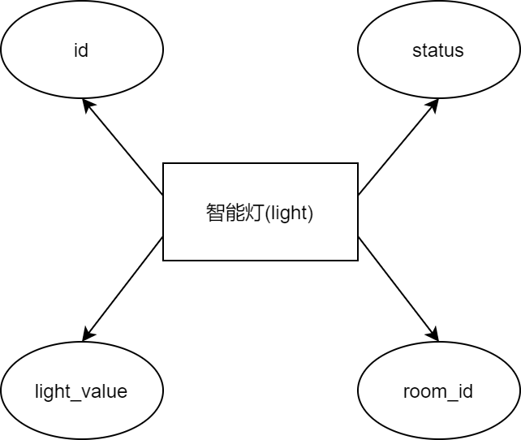

### 八张关系表的模型示意图

#### 住户信息表 (resident)

住户信息表包括姓名()、性别(sex)、身份证号(id_card)、电话号码(phone)、微信id(wecharid)五部分

#### 管理员信息表 (admin)

管理员信息表包括姓名()、性别(sex)、电话号码(phone)、微信id(wecharid)四部分

#### 身份表(user_level)

身份表包括微信id(wecharid)和用户等级(level)两部分

#### 订单信息表 (order)

订单信息表包括订单编号(id)、订单应付金额(pmoney)、预定入住日期(scid)、预计离开日期(sgo)、实际入住日期(cid)、结账离开日期(go)、微信id(wecharid)、房间编号(room_id)八部分

#### 房间信息表(room)

房间信息表包括房间编号(id)、房间金额/日(money)、房间当前温度(temperature)、房间当前湿度(humidity)、房间类型(rtype)五部分

#### 智能空调信息表(air_conditioning)

智能空调信息表包括空调编号(id)、空调状态(status)、空调当前温度(air_tmp)、房间编号(room_id)四部分

#### 智能灯信息表(light)

智能灯信息表包括灯的编号(id)、灯的状态(status)、灯的当前温度(light_value)、房间编号(room_id)四部分

#### 开门记录信息表(door_opening_record)

开门记录信息表包括记录编号(id)、微信id(wecharid)、开门时间(open_time)三部分

