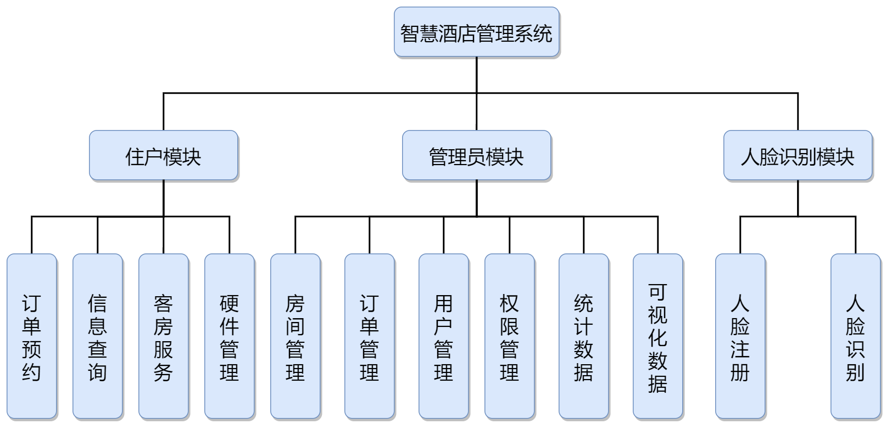

# 数据库系统课设

## 系统分析

### 开发背景

目前全国酒店行业发展开始趋于稳定，单纯继续发展酒店数量无法大跨度提 升酒店在市场中的竞争实力，所以现在酒店市场开始脱离量的变化，开始追求的 质的提升，而智慧酒店概念和体系的引入成为了酒店“升级”的热门选择。 就项目初开展地桂林而言，桂林是著名的旅游城市。从 2017 年至今，年游 客流量同比增长速率一直在 20%以上，随着国民经济水平的提高旅游业也得到了 空气的发展，桂林市政府也就旅游等服务业推出过《桂林市现代服务业发展“十 三五”规划》等鼓励政策。因此在旅游业发达且呈上升趋势的城市开展项目最适 合不过了。

### 市场分析

#### 行业发展程度和动态 

智慧酒店这个行业现如今是属于前景良好,资金投入中庸，发展速度近几年 才快，整体来说是处于一种市场空缺大，但是做好并引领难的地步。现在的发展 动态是大型企业已经开始介入，智慧酒店市场再次掀起波澜，充满机遇但风险也 高

#### 创新和技术占比

在这个行业创新和技术始终扮演者重要角色，哪家公司的技术更新，更成熟，更有保障，无疑会成为竞争市场的有力手段。而创新不管是模式还是技术， 对于任何行业都是占比极大的一块。虽然智慧酒店行业发展方向和执行手段相差 不会很大，但是商业模式的创新和对象选择的创新都是可以对改变市场格局的重 要影响，所以创新和技术在智慧酒店这个行业中扮演者影响市场发展的角色之 一。 

#### 行业资金投入和发展趋势 

目前全国主要城市的酒店智能化改造市场已经超过 1000 亿元，且每年酒店 数量还有 20%左右的增长，这是酒店升质和提量的重要体现。除此之外，阿里巴 巴等大型企业的资本投入必然会使智慧酒店行业的资金投入在未来持续增长，其 资本透入也代表智慧酒店行业的发展开始走向飞速发展阶段。由此可以看出，未10 来酒店智能系统应用前景非常广阔。 

####  经济发展和政府对该行业的影响 

智慧酒店行业的本质就是服务业，属于非必须发展对象，所以受经济影响比较大，但是成型的智慧酒店影响不大，只是经济会影响酒店方面是否继续改造酒 店的念头，进而影响整体行业的发展。在政府方面一直是积极鼓励的，因为智慧 酒店在为酒店增益和升级的同时也是给当地城市的酒店行业提高品级和形象。为 当地的经济发展做出贡献，尤其是对旅游业发达的地区，是提升当地旅游形象的 绝佳选择，因此政府一直都是鼓励智慧酒店的发展。

### 功能需求

根据智慧酒店的特点并考虑用户入住智慧酒店的实际需求，我们设计的智慧酒店系统的预期功能包含三个模块：第一，服务住户的使用模块；第二，服服务酒店管理员的管理模块；第三用于开门的人脸识别模块，系统结构图如图1所示：

管理员模块

房间管理：实现管理员对房间的控制，允许管理员查看房间的开门记录、入住信息、房间当前温度、房间的硬件状态信息等信息；允许管理员对房间的硬件设施进行操控；允许管理员对房间的价钱、类型、房间名称等信息进行修改。

订单管理：允许管理员对订单进行查看、修改、增添、删除等操作。

用户管理：允许管理员对用户信息、权限等进行查看、修改、增添、删除等操作。

权限管理：允许对不同的等级管理员进行权限管理，对其权限进行查看、修改、增添、删除等操作。

统计数据：统计基本的酒店营业信息，如统计近一周内入住的人数、营业额等信息。

可视化数据：对统计出的数据进行可视化处理，如可视化的列出入住人数变化的曲线；实现订单信息导出功能等。

客户模块

预约房间：客户浏览已有房间信息、预定房间、退订房间等功能。

信息查询：客户查看自己的订单信息、房间信息（查看温度、湿度等信息）。

房间管理：客户对房间设施的控制管理，通过人脸识别的方式实现开门的操作；住户对房内基础设施如空调，电灯等设备的控制。

### 用户需求分析

1.客户浏览已有房间信息：客户可以在微信小程序上查看现有的空闲房间及房间的相关信息，如房间大小、房间价格等。

2.预定房间：客户可以通过微信小程序进行预订房间，预订缴费。

3.退订房间：客户可以通过微信小程序进行退订房间；提前结账离开。

4.客户查看自己的订单/房间信息：支持客户在预订房间之后查看订单信息，和房间的信息如房间的实时温度和实时湿度等信息。

5.操控房间内空调等设备：支持已入住的客户通过小程序对房间内的智能设备进行控制，如调节空调温度，调节灯光等操作；房间发生异常状况时也会发送消息通知住户和保安。

6.开门：采用人脸识别的技术，对住户进行人脸注册，每次开门会自动进行人脸识别，识别通过则开门。

### 业务流程

### 可靠性分析

1.故障的频率及严重性

故障频率低，严重性小。

2.可恢复性
软件突然崩溃或者发生错误后应该可以回滚到上一次的操作中，忽略当前此次操作。

3.可预见性
当点击某些控件时候，在会发生错误或者数据修改时候应当给与必要的提示。

### 可用性分析

1.人员因素
财务系统保密性高，对此应该加强安全措施。

2.用户界面需求
界面美观，便于操作。

3.用户文档和培训材料
在提交软件时期应该附带用户文档以及必要的培训材料,以使得财务人员可以更快的适应新的软件。

 

### 接口需求

#### 界面设计

分析与讨论后，将智慧酒店系统的界面设计为两大部分：小程序界面和网页界面。

小程序界面：

a. 酒店客户端

1. 初始封面界面：未使用过酒店小程序用户第一次进入小程序的欢迎界面，界面温馨舒适。

2. 首页界面：展示简单房间筛选条件模块，配查询房间按钮；展示推荐模块，如“猜您喜欢”模块。

3. 订单界面：为已下单用户展示已订订单信息模块，联系客服模块；为未下单用户展示提示信息模块，并展示房间列表页面跳转模块。

4. 在住界面：展示房间信息模块，如房间用户、住宿时间等，仅对已下单且时间匹配的用户展示信息，未下单用户和已下单但时间不匹配的用户展示提示信息；展示开锁模块；展示智能硬件模块，如灯光、空调等；展示客房服务模块，如预约退房、紧急呼叫、呼叫保洁等。
5. 房间类型界面：展示筛选模块，模块内包括入住的多项筛选选项；展示房间列表模块，默认情况下展示所有房间类型，跟随筛选条件展示匹配条件的房间类型列表。
6. 预订界面：展示个人信息填写模块，填写预订订单时的个人信息。
7. 智能硬件界面：展示硬件控制模块，以改变硬件属性，不同硬件拥有不同的硬件界面。

b. 酒店工作人员端

1. 房间列表界面：展示房间列表模块，包括已入住且时间匹配的房间列表和其他房间列表。

2. 个人信息界面：展示个人信息模块，不包含身份证信息；展示行为记录模块，如个人开门记录。

3. 房间详情界面：展示房间信息模块，包含房间具体固定信息；展示个人信息模块，包含用户填写的个人信息，敏感信息模糊展示；展示订单信息模块，包含具体订单信息。

网页界面：

1. 登录界面：提供管理系统的登录界面，界面要求简洁美观。
2. 首页：显示酒店近期内的统计数据，如近期入住人数、近期订单成交数、近期盈利额等。显示一周内的统计数据的变化曲线图。
3. 用户管理界面：以表格的形式展示各个用户的信息，如姓名、身份证号、权限登记等信息。并提供可以对数据进行增加、修改、筛选和删除的按钮或子页面。
4. 订单信息管理界面：以表格的形式展示各个订单的信息，如订单编号、预计输住时间等信息。并提供可以对数据进行增加、修改、筛选和删除的按钮或子页面。
5. 酒店运行状况查看界面：以曲线图/柱状图的形式显示酒店近两周内的统计数据。统计数据包括近期入住人数、近期订单成交数和近期盈利三项。以天为单位对统计数据进行显示。
6. 房间信息管理界面：以表格的形式展示每个房间的信息，如房间号、房间价格、房间温度、房间湿度等信息。并提供可以对数据进行增加、修改、筛选和删除的按钮或子页面。
7. 管理员个人信息页面：显示当前管理员的个人信息。
8. 用户建议界面：以表格的形式展示用户上传的建议。

#### 小程序接口

说明：接口数据全部以JSON数据格式进行传输。具体API接口说明请参考附录—小程序API接口说明。

**用户信息管理相关接口：**

1. 住户提交个人数据到用户数据表中的接口

2. 获取用户数据表中的个人数据的接口

**订单信息管理相关接口：**

1. 获取订单数据表中的订单数据的接口
2. 删除订单数据表中的订单数据的接口

**房间信息管理相关接口：**

1. 获取房间数据表中的房间数据的接口

2. 获取开门记录数据表中的开门记录数据的接口

3. 修改订单数据表中的订单数据的接口
4. 改开门记录数据表中的开门记录数据的接口

**硬件信息管理相关接口：**

1. 获取硬件数据表中的硬件数据的接口

2. 修改硬件数据表中的硬件数据的接口

**系统信息管理相关接口：**

1. 获取用户唯一身份凭证的接口
2. 获取用户身份数据表中用户身份数据的接口

#### 网页接口

说明：接口数据全部以JSON数据格式进行传输。具体API接口说明请参考附录—网页API接口说明。

**统计数据相关接口：**

1. 获取一周内/两周内入住人数、订单成交数、盈利额和用户建议的数量
2. 获取每日的入住人数、订单成交数、盈利额和建议的数量

**用户信息管理相关接口：**

1.  获取用户数据表中的个人数据的接口
2.  像用户数据表中添加数据的接口
3.  修改用户数据表中的数据的接口
4.  删除用户数据表中的数据的接口

**订单信息管理相关接口：**

1.  获取订单数据表中的订单数据的接口
2.  像用订单数据表中添加数据的接口
3.  修改订单数据表中的数据的接口
4.  删除订单数据表中的接口

**房间信息管理相关接口：**

1. 获取房间数据表中的订单数据的接口
2. 像用房间数据表中添加数据的接口
3. 修改房间数据表中的数据的接口
4. 删除房间数据表中的接口

**管理员个人信息相关接口：**

1. 获取管理员个人信息的接口

**用户建议查看相关接口：**

1. 获取用户提交的建议的接口
2. 删除用户提交的建议的接口

### 安全需求

#### 用户安全性需求

对于操作系统，网络系统以及数据库都有比较高的安全需求。

1. 在传输用户敏感性数据时数据都是经过加密后传输，双方还会就传输数据源进行身份确认。
2. 管理系统内设置不同级别用户，不同级别用户拥有不同权限。除开系统的超级管理员权限，不同管理员权限范围不一，只有拥有涉及处理用户个人信息工作职能的管理员才有查看用户个人信息的权限。
3. 酒店内不使用实体房卡或钥匙，充分保证住户开门权限的主权，避免因丢失钥匙等物理因素导致的开门主权受制，从而致使用户安全问题。

#### 

#### 密码安全性需求

具体要求如下：

1. 设置密码位数要求和数据类型要求，设置最低位数要求，充分避免密码弱口令。
2. 设置登录限制机制，设置账号密码输入检测次数限制，在达到一定错误次数后，再次尝试会伴随验证机制。在伴随验证机制的前提下再达到一定次数后会进行登录锁定。
3. 密码在系统内从不以明文方式展示。

#### 系统安全性需求

智慧酒店管理系统的系统安全性主要体现在系统保密性、系统完整性、可用性与抗毁性、系统防病毒四个方面：

系统保密性：只有授权的用户才能动用和修改信息系统的信息，且必须防止信息的非法修改和未授权泄漏。

系统完整性：信息必须以其原形被授权的用户所用只有授权的用户才能修改信息。

可用性与抗毁性：设置备份系统、容错机制，防止在系统出现单点失败时，系统的备份机制可以保证系统的正常运行。

系统防病毒：定时对系统进行安全扫描，发现病毒后及时清除。

此外，将智慧酒店管理系统搭建在酒店的内网中，不在公网中显现，借此来减少被攻击的次数。

#### 服务安全性需求

对于管理系统和微信小程序的后端服务器，检查有无高危端口，关闭不必要端口对端口进行放行限制。使用端口扫描器扫描系统已开放的端口，分析统计系统开放的哪些服务可能引起黑客入侵，实时监控这些端口状态。设置好安全记录的访问权限。安全记录在默认情况下是没有保护的，把它设置成只有管理员和系统账户才有权访问。

对于微信小程序对外开放的后端接口，每次访问需对用户身份进行校验，且数据包数据需具有时效性。身份验证通过时间戳加密钥等技术实现数据包不可重复发送。避免恶意抓包导致的信息泄漏、越权等问题。

 

