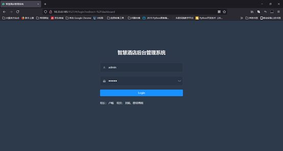

# 系统测试

 

## 系统功能测试

 

### 连接测试

使用死链接测试工具 XenuLink Sleuth 来检查本系统的所有链接是否存在死链接，

测试界面如图1所示：

 

 

测试报告如图2所示：

结论：未出现“Not found”结果，故不存在死链接，系统所有链接均可有效点击和

跳转。

 

 

### 表单测试

 

此处测试用户登录场景的表达操作，验证输入的用户名/密码，界面如图3所

示:

 

➢ 文本框测试点

空字符串提交或超长度提交时，报错提示只有一种，即“登录失败，用户名或密码

错误”

➢ 密码框测试点

\1. 密码长度有限制，不少于 6 位

\2. 报错提示只有一种，即密码长度不足 6 位

➢ 表单按钮（提交）测试点

\1. 不支持回车，仅支持单击

\2. 快速多次点击会重复提交表单

\3. 网络中断（弱网）提交会有“Network Error”提示

\4. 提交后内容会进行加密

\5. 提交之后无提示

\6. 提交做权限校验控制

 

 

 

## 性能测试

使用 JMeter 测试工具进行测试登录模块，设置线程数为 1000，循环一次，最后得

到其异常结果为7.75%结果如图4所示:

 

## 用户界面测试

### 1.导航测试

导航测试界面如图5所示：

 

导航形式：按钮、对话框、列表、窗口等直观，样式正确，风格一致。

导航链接：页面能够进行正常跳转和连接。

 

### 2.图形测试

➢ 图形有明确用途，能够链接到对应具体的页面。

➢ 所有页面字体的风格一致。

➢ 背景颜色与字体颜色和前景颜色相搭配。

➢ 图片的大小合适，采用 JPG 压缩。

➢ 文字回绕正确，窗口和段落排列正常并且未出现孤行。

 

### 3.表格测试

表格基本格式测试

每一栏的宽度足够宽，表格里的文字没有折行，不会因为某一格的内容太多，而将整

行的内容拉长，如图6所示：

 

 

## 兼容性测试

➢ IE11

在此浏览器上进行了完整流程的测试，系统运行流畅，风格无变化，仅部分图片产

生位移，对界面产生一定影响。如图9所示：

 

➢ Chrome

在此浏览器上进行了完整流程的测试，系统运行流畅，风格没有变化，字体和图片

大小合适，对界面未产生变化。如图10所示：

 

 

➢Firefox

在此浏览器上进行了完整流程的测试，系统运行流畅，风格没有变化，字体和图片

大小合适，对界面未产生变化。如图11所示：

 

## 安全测试

使用 web 安全测试工具 Arachni 进行漏洞测试，测试结果如图12所示：

 

 

 

 