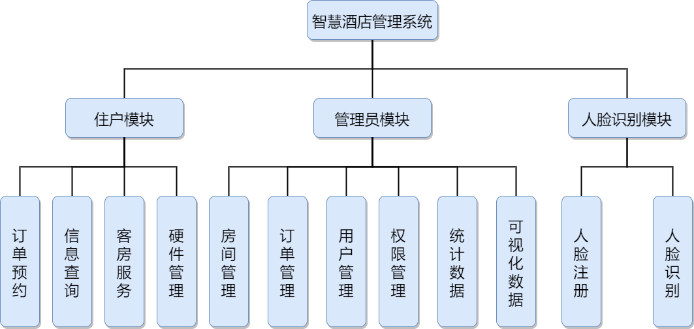

### 功能需求

#### 总体功能模块设计

根据智慧酒店的特点并考虑用户入住智慧酒店的实际需求，我们将本系统的预期实现的功能设计为两个模块：一是服务酒店管理员的管理模块，二是服务客户的使用模块，三为人脸识别系统模块。系统模块设计图如下图所示：

#### 管理员模块

房间管理模块：该子模块主要的功能是为管理员提供查看房间控制，查看房间的开门记录、入住信息、房间当前温度、房间的硬件状态信息等信息；允许管理员对房间的硬件设施进行操控；允许管理员对房间的价钱、类型、房间名称等信息进行修改。

订单管理模块：该子模块主要的功能是允许管理员对订单信息进行查看、修改、增添和删除。在用户到达酒店时酒店前台人员通过该模块为用户登记实际入住酒店的时间。当用户结账离开酒店时记录实际离开时间。该模块还可以将订单信息导出为excel文件方便对信息进行进一步的处理。

用户管理模块：该子模块主要的功能是为对用户信息进行查看、修改、增添、删除。用户的信息包括微信id、姓名、性别、身份证号、电话和权限等级。低权限的用户不能对高权限的用户进行任何操作。

权限管理模块：该子模块主要功能是对不同权限等级的用户进行权限管理。根据使用者的身份对其进行等级划分。根据权限等级分配酒店信息权限。

统计数据模块：该子模块主要负责对一些基本的酒店营业信息进行统计，比如统计近一周内入住的人数、营业额等信息。通过对数据库中数据的计算得出这些数据。

可视化数据模块：该子模块主要是对统计出的数据进行可视化处理，比如可视化的列出入住人数变化的曲线；还需要实现对订单信息的导出功能。

#### 用户模块

房间预约：该子模块主要实现用户浏览已有房间信息、预定房间、退订房间等功能。

信息查询：该子模块主要实现用户查看自己的订单信息、房间信息（查看温度、湿度等信息）。

房间管理：该子模块主要实现对房间设施的控制管理，通过人脸识别的方式实现开门的操作，好友来访时向用户推送询问是否开门的消息；用户对房内基础设施如空调，电灯等设备的控制。

#### 人脸识别模块

人脸信息注册：该子模块是通过用户提交的人脸信息提取人脸特征数据用于后续的人脸识别。

人脸识别：该子模块的功能为提取当前摄像头画面下的人脸信息并在人脸数据库中进行特征匹配并返回识别结果。

### 接口需求

#### 界面设计

 **网页端界面需求：**

1. 登录界面：提供管理系统的登录界面，界面要求简洁美观。
2. 首页：显示酒店近期内的统计数据，如近期入住人数、近期订单成交数、近期盈利额等。显示一周内的统计数据的变化曲线图。
3. 用户管理界面：以表格的形式展示各个用户的信息，如姓名、身份证号、权限登记等信息。并提供可以对数据进行增加、修改、筛选和删除的按钮或子页面。
4. 订单信息管理界面：以表格的形式展示各个订单的信息，如订单编号、预计输住时间等信息。并提供可以对数据进行增加、修改、筛选和删除的按钮或子页面。
5. 酒店运行状况查看界面：以曲线图/柱状图的形式显示酒店近两周内的统计数据。统计数据包括近期入住人数、近期订单成交数和近期盈利三项。以天为单位对统计数据进行显示。
6. 房间信息管理界面：以表格的形式展示每个房间的信息，如房间号、房间价格、房间温度、房间湿度等信息。并提供可以对数据进行增加、修改、筛选和删除的按钮或子页面。
7. 管理员个人信息页面：显示当前管理员的个人信息。
8. 用户建议界面：以表格的形式展示用户上传的建议。

**小程序端界面设计：**

a. 酒店客户端

1. 初始封面界面：未使用过酒店小程序用户第一次进入小程序的欢迎界面，界面温馨舒适。

2. 首页界面：展示简单房间筛选条件模块，配查询房间按钮；展示推荐模块，如“猜您喜欢”模块。

3. 订单界面：为已下单用户展示已订订单信息模块，联系客服模块；为未下单用户展示提示信息模块，并展示房间列表页面跳转模块。

4. 在住界面：展示房间信息模块，如房间用户、住宿时间等，仅对已下单且时间匹配的用户展示信息，未下单用户和已下单但时间不匹配的用户展示提示信息；展示开锁模块；展示智能硬件模块，如灯光、空调等；展示客房服务模块，如预约退房、紧急呼叫、呼叫保洁等。
5. 房间类型界面：展示筛选模块，模块内包括入住的多项筛选选项；展示房间列表模块，默认情况下展示所有房间类型，跟随筛选条件展示匹配条件的房间类型列表。
6. 预订界面：展示个人信息填写模块，填写预订订单时的个人信息。
7. 智能硬件界面：展示硬件控制模块，以改变硬件属性，不同硬件拥有不同的硬件界面。

b. 酒店工作人员端

1. 房间列表界面：展示房间列表模块，包括已入住且时间匹配的房间列表和其他房间列表。

2. 个人信息界面：展示个人信息模块，不包含身份证信息；展示行为记录模块，如个人开门记录。

3. 房间详情界面：展示房间信息模块，包含房间具体固定信息；展示个人信息模块，包含用户填写的个人信息，敏感信息模糊展示；展示订单信息模块，包含具体订单信息。

#### 小程序接口

说明：接口数据全部以JSON数据格式进行传输。具体API接口说明请参考附录—小程序API接口说明。

**用户信息管理相关接口：**

1. 住户提交个人数据到用户数据表中的接口

2. 获取用户数据表中的个人数据的接口

**订单信息管理相关接口：**

1. 获取订单数据表中的订单数据的接口
2. 删除订单数据表中的订单数据的接口

**房间信息管理相关接口：**

1. 获取房间数据表中的房间数据的接口

2. 获取开门记录数据表中的开门记录数据的接口

3. 修改订单数据表中的订单数据的接口
4. 改开门记录数据表中的开门记录数据的接口

**硬件信息管理相关接口：**

1. 获取硬件数据表中的硬件数据的接口

2. 修改硬件数据表中的硬件数据的接口

**系统信息管理相关接口：**

1. 获取用户唯一身份凭证的接口
2. 获取用户身份数据表中用户身份数据的接口

#### 网页接口

说明：接口数据全部以JSON数据格式进行传输。具体API接口说明请参考附录—网页API接口说明。

**统计数据相关接口：**

1. 获取一周内/两周内入住人数、订单成交数、盈利额和用户建议的数量
2. 获取每日的入住人数、订单成交数、盈利额和建议的数量

**用户信息管理相关接口：**

1.  获取用户数据表中的个人数据的接口
2.  像用户数据表中添加数据的接口
3.  修改用户数据表中的数据的接口
4.  删除用户数据表中的数据的接口

**订单信息管理相关接口：**

1.  获取订单数据表中的订单数据的接口
2.  像用订单数据表中添加数据的接口
3.  修改订单数据表中的数据的接口
4.  删除订单数据表中的接口

**房间信息管理相关接口：**

1. 获取房间数据表中的订单数据的接口
2. 像用房间数据表中添加数据的接口
3. 修改房间数据表中的数据的接口
4. 删除房间数据表中的接口

**管理员个人信息相关接口：**

1. 获取管理员个人信息的接口

**用户建议查看相关接口：**

1. 获取用户提交的建议的接口
2. 删除用户提交的建议的接口