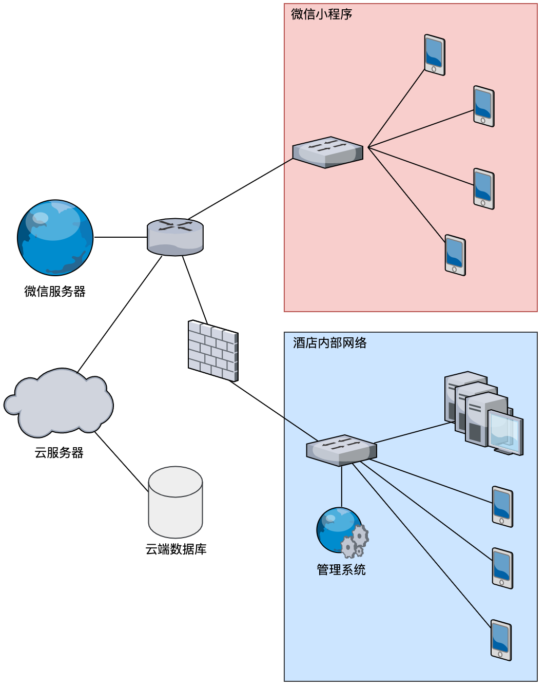

#### 网络结构设计与设备配置方案

本智慧酒店系统主要分为网页端和微信小程序端，其中微信小程序段前端可以通过微信进行访问。微信小程序段后端搭建在腾讯云服务器当中。网页端搭建在酒店内网当中，从外网无法访问酒店管理系统。

（1）系统网络结构设计

系统网络拓扑图如图所示：

智慧酒店系统主要分为两大部分搭载在微信小程序上的手机端与搭载在酒店内网中的网页端。

系统手机端搭载在微信小程序上，其中微信小程序前端通过访问微信服务器访问。微信小程序前端与后端进行交互。微信小程序后端搭建在腾讯云服务器当中，同时云端服务器也搭载在腾讯云服务器当中。

系统网页端搭载在酒店内部网络当中且对内网IP进行限制性筛选。只有酒店内部固定IP的设备可以访问酒店内部的管理系统。管理系统需要访问云端数据库的数据。

（2）设备配置方案

**服务器（搭载酒店管理系统）**

| 设备名称 | HP惠普ProLiant DL580 G7(B8C93A)                              |
| -------- | ------------------------------------------------------------ |
| 基本参数 | 产品类型:企业级；产品类别:机架式；产品结构:4U                |
| 处理器   | CPU类型: Intel至强E7-4800 CPU型号: Xeon E7-4807 CPU频率:1.86GHz 标配CPU数量:2颗 最大CPU数量:4颗 制程工艺:32nm 三级缓存:18MB 总线规格:QPI4.8GT/s CPU核心:六核( Istanbul) CPU线程数:12线程 |
| 主板     | 扩展槽:11个                                                  |
| 内存     | 内存类型:DDR3  内存容量:32GB 内存插槽数量:4 最大内存容量:2TB |
| 存储     | 硬盘接口类型: SATA/SAS/SSD 标配硬盘容量:标配不提供 最大硬盘容量:4TB 内部硬盘架数:最大支持8块SAS/ SATA/SSD硬盘 热插拔盘位:支持热插拔 RAID模式:1个智能阵列P410i/1 GB FBWC 光驱:DVD-RW |
| 网络     | 网络控制器:1 GbE NC375i四端口网卡                            |
| 电源性能 | 电源类型:热插拔冗余电源 电源功率:2*1200W                 |

**交换机**

| 设备名称 | 华为S5700-24TP-SI(AC)                                        |
| -------- | ------------------------------------------------------------ |
| 主要参数 | 产品类型:千兆以太网交换机  应用层级:三层  传输速率:10/100/1000Mbps  交换方式:存储-转发  背板带宽:256Gbps  包转发率:36MppS MAC地址表:16K |
| 端口参数 | 端口结构:非模块化  端口数量:28个 扩展模块:1个堆叠扩展插槽  传输模式:全双工/半双工自适应 |
| 功能性能 | 网络标准:IEEE802.3,IEEE802.3u,IEEE802.3ab,IEEE802.3z EEE 802.1Q, EEE 802.1d, EEE 802.1X 堆叠功能:可堆叠 VLAN:支持4K个VLAN 支持 Guest VLAN、 Voice VLAN 支持基于MAC/协议IP子网/簽略/端口的VLAN 支持1:1和N:1VLAN交换功能 QOS:支持对端口接收和发送报文的速率进行限制 支持报文重定向 支持基于端口的流量监管,支持双速三色CAR功能 每端口支持8个队列 支持WRR、DRR、SP、WRR+SP、DRR+SP队列调度算法 支持报文的802.1p和DSCP优先级重新标记 ...... |
| 其他参数 | 电源电压:AC100-240V 电源功率:<40W 产品尺寸:250×180x43.6mm 产品重量:<1.4kg 环境标准:工作温度:0-50C 工作湿度:10%-90% 存储温度:-5-55℃ 存储湿度:10%-90% |

**无线路由器**

| 设备名称 | ASUS华硕RT-AC68U                                             |
| -------- | ------------------------------------------------------------ |
| 主要性能 | 产品类型:企业级无线路由器 网络标准:无线标准:IEEE802.11n、IEEE802.119、IEEE802.11b、IEEE EEE 802. 11ac 网络协议:IPv4,IPv6 最高传输速率:1300Mbps 频率范围:双频(2.4GHz,5GHz)  网络接口:10/100/1000 Mbps WAN口 4个10/100/1000 Mbps LAN口 |
| 天线     | 天线类型:外置天线  天线数量:3根                         |
| 功能参数 | VPN支持:支持 Qos支持:支持 防火墙功能:内置防火墙 WPS功能:支持WPS一键加密功能 |
| 其他参数 | 状态指示灯:PWR,AIR,LAN,WAN,USB 电源电压:AC100-240V,50-60Hz DC19V,最大1.75A 产品尺寸:220x83.3x160mm 产品重量:640 |

