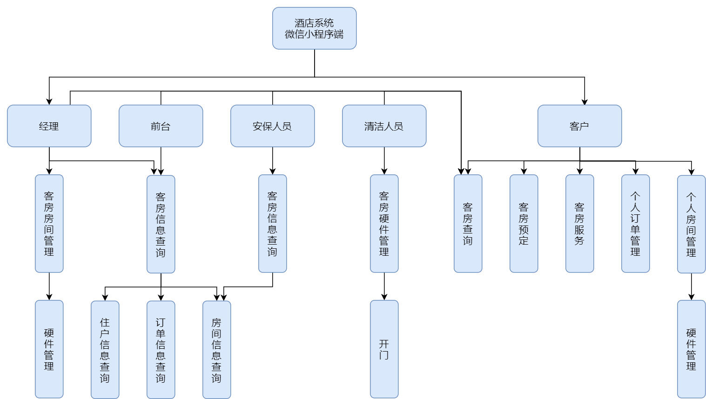

## 系统总体设计

在本章中，跟着第二章的各类需求，对系统进行进一步的设计规划。

### 系统设计原则

在系统设计分析中，需要满足以下原则以保持设计分析的可靠性。

（1）阶段开发原则：分阶段明确系统的全面设计

（2）易用性原则：让网上客户的系统操作简明易用，最大化地减轻管理人员的负担，实现业务流程的自动化。

（3）业务完整性原则：保证业务的完整，有时候业务中会出现突发情况，系统要求可以做出正确合适的响应，保持数据的完整性。

（4）业务规范化原则：系统的实现是为了业务流程操作的规范化,提高业务操作的效率。

（5）可扩展性原则：系统不是一成不变得。随着使用者需求的变化,要求 系统能够快速地做出变化。这就需要在设计之时,就要尽可能地将各个功能模 块分离开来,便于系统的扩展。

### 系统设计目标

该系统面向酒店管理人员和酒店住户。系统为酒店管理人员提供便捷的酒店管理业务，管理者可以通过网页端和微信小程序端对酒店的订单、房间信息、用户信息等进行管理。酒店住户可以在微信小程序端便捷的入住房间。同时系统还提供人脸识别整个系统提升了酒店住户的入住体验也提高了酒店工作人员的管理效率。

系统主要满足以下目标：

（1）系统能够快速处理日常的业务及相关数据，实现实时查询各种入住信息。

（2）系统能够实时的录入住宿单、换房单等的情况。

（3）系统能够实时查询客房信息、客人账单信息等的具体情况。

（4）系统能够建立客户的资料，方便日后建立良好的客户关系。

（5）系统能够保障数据的安全性：不同用户有对数据查看，修改等处理不同的权限。

（6）系统能够可以提供微信小程序平台的预定系统。用户可以在手机上进行房间的预定以及查看自己的房间信息、修改订单信息等。

（7）系统可以融入人工智能的元素，用户在预定房间时在手机上提交自己的照片。系统可以对人脸特征信息进行提取。到达酒店后可以使用人脸进行开门。

（8）系统可以与酒店中的智能硬件进行对接，用户可以在手机端操控智能硬件。

（9）系统可以提升酒店的安全性，实时监控各房间的温度与湿度信息。如若异常立即通知安保人员前往查看。

（10）系统中用户可以在手机端给酒店的服务提交建议，酒店管理员可以在网页端查看建议。

### 系统数据库设计

#### 数据库关系分析

根据上述的需求调研，可以将数据库的关系抽象为如下描述：

一个住户可以预定多个房间（产生多个订单）。一个订单只属于一个住户。住户可以对每个房间内的多个智能家居进行控制。一个酒店管理人员可以管理多个订单，对订单信息进行修改，确认每个订单的入住日期和结账离开日期。一个订单也可以被多个管理人员管理。一个房间对应多条开门记录，一条开门记录只对应一个房间。一个管理人员可以查看多个房间的开门记录。一条开门记录可以被多个管理员查看。一个房间内置多个智能家居。一个智能家居只属于一个房间。

#### 概念结构与逻辑结构的设计

根据需求分析部分与上述抽象关系，可以设计出ER图，如下图所示：

根据上述 E-R 图的设计以及 E-R 图转化为关系模型的规范,作出关系模型的转化，关系的码将用下划线表示，具体如下表所示：

| 关系模型                                                     |
| :----------------------------------------------------------- |
| 用户信息（<u>wecharid</u>,name,sex,id_card,phone,level）     |
| 管理员（<u>id,</u>username,password,token）                  |
| 订单（<u>id</u>,deposit,pmoney,scid,sgo,cid,go,<u>wecharid</u>,<u>room_id</u>,id_status） |
| 房间（<u>id</u>,rtype,bedtype,maxnum,area,rwin,rlock,money,temperature,humidity） |
| 智能空调（<u>id</u>,status,air_tmp,<u>room_id</u>）          |
| 智能灯（<u>id</u>,status,light_value,<u>room_id</u>）        |
| 人脸信息（<u>wecharid</u>,face_id）                          |
| 意外事件（<u>id</u>,<u>room_id</u>,abnormal_time,temperature,humidity） |
| 开门（<u>id</u>,<u>wecharid</u>,open_time,<u>room_id</u>）   |
| 记录（<u>room_id</u>,abnormal_time,temperature,humidity）    |

#### 数据库物理结构设计

本系统依据上述的关系模型建立了八张关系表，它们的表名以及对应的名称如表2-1所示：

|        表名         |        备注        |
| :-----------------: | :----------------: |
|        user         |     用户信息表     |
|        admin        |    管理员账号表    |
|      face_info      |     人脸信息表     |
|        order        |     订单信息表     |
|        room         |     房间信息表     |
|  air_conditioning   |   智能空调信息表   |
|        light        |    智能灯信息表    |
| door_opening_record |   开门记录信息表   |
|   accident_record   | 意外事件记录信息表 |

（1）数据库用户信息表 (user)

用户信息表主要用于存储用户的信息，如姓名，性别等。通过该表可以操作每一个住户的信息。在数据表中id（用户编号）为主码。 wecharid为微信用户的唯一标志代号可用于区分用户的身份。该表如表所示：

| 字段名   |   数据类型   | 是否为主键 | 是否为外键 |       检查规则       |             备注             |
| -------- | :----------: | :--------: | :--------: | :------------------: | :--------------------------: |
| wecharid | VARCHAR( 50) |     是     |     否     |       NOT NULL       | 微信id，微信用户的唯一标识； |
| name     | VARCHAR(10)  |     否     |     否     |          无          |             姓名             |
| sex      |   CHAR(4)    |     否     |     否     | sex='男' or sex='女' |             性别             |
| id_card  | VARCHAR(50)  |     否     |     否     |       NOT NULL       |           身份证号           |
| phone    | VARCHAR(20)  |     否     |     否     |       NOT NULL       |           电话号码           |
| level    |     INT      |     否     |     否     |       NOT NULL       | 用户等级, 有1，2，3三个等级  |

（2）数据库管理员信息表 (admin)

管理员信息表主要用于储存管理员的账号和密码。该表如表所示：

|  字段名  |   数据类型   | 是否为主键 | 是否为外键 | 检查规则 |            备注            |
| :------: | :----------: | :--------: | :--------: | :------: | :------------------------: |
|    id    |     INT      |     是     |     否     |    无    |          主键自增          |
| username | VARCHAR(10)  |     否     |     否     | NOT NULL |            账号            |
| password | VARCHAR(10)  |     否     |     否     | NOT NULL |            密码            |
|  token   | VARCHAR( 10) |     否     |     是     | NOT NULL | 用作身份验证，用户表的主键 |

（3） 数据库人脸信息表 (face_info)

|  字段名  |   数据类型   | 是否为主键 | 是否为外键 | 检查规则 |            备注            |
| :------: | :----------: | :--------: | :--------: | :------: | :------------------------: |
| wecharid | VARCHAR( 10) |     是     |     否     | NOT NULL | 微信id，微信用户的唯一标识 |
| face_id  | VARCHAR(10)  |     否     |     否     | NOT NULL | 人脸算法生成的唯一人脸标志 |

（4）数据库订单信息表 (order)

订单信息表主要用于保存用户的订单信息，如应付金额，入住日期等。在设计上用户和订单是一对多的关系，订单与房间是1对1的关系。在表中订单编号为主键。同时该表参照resident表的wecharid作为外键和room表的房间id作为外键，该表如表所示：

|  字段名   |   数据类型   | 是否为主键 | 是否为外键 |    检查规则     |                            备注                             |
| :-------: | :----------: | :--------: | :--------: | :-------------: | :---------------------------------------------------------: |
|    id     |     INT      |     是     |     否     | NOT NULL;UNIQUE |                     订单编号，主键自增                      |
|  deposit  |     INT      |     否     |     否     |       无        |                          订单订金                           |
|  pmoney   |     INT      |     否     |     否     |    NOT NULL     |                        订单应付金额                         |
|   scid    |   DATETIME   |     否     |     否     |    NOT NULL     |                        预定入住日期                         |
|    sgo    |   DATETIME   |     否     |     否     |    NOT NULL     |                        预计离开日期                         |
|    cid    |   DATETIME   |     否     |     否     |       无        |                        实际入住日期                         |
|    go     |   DATETIME   |     否     |     否     |       无        |                        结账离开日期                         |
| wecharid  | VARCHAR( 50) |     否     |     是     |       无        |                 微信id，微信用户的唯一标识                  |
|  room_id  |     INT      |     否     |     是     |       无        |                          房间编号                           |
| id_status |     INT      |     否     |     否     |       无        | 订单状态：0表示订单已过期、1表示订单进行中、2表示订单已取消 |

（5） 数据库房间信息表 (room)

房间信息表主要包括了房间的基本信息，如房间类型，房间编号等。其中还包括房间温度、房间湿度等状态信息。状态信息在设计上是由房间内传感器进行动态更新。房间与智慧家居是一对多的关系，与订单是1对1的关系。该表如表所示：

|   字段名    |  数据类型   | 是否为主键 | 是否为外键 |    检查规则     |                            备注                            |
| :---------: | :---------: | :--------: | :--------: | :-------------: | :--------------------------------------------------------: |
|     id      |     INT     |     是     |     否     | NOT NULL;UNIQUE |                     房间编号，主键自增                     |
|    rtype    | VARCHAR(50) |     否     |     否     |    NOT NULL     |                          房间类型                          |
|   bedtype   | VARCHAR(50) |     否     |     否     |    NOT NULL     |                          房间床型                          |
|   maxnum    |     INT     |     否     |     否     |    NOT NULL     |                      房间居住人数上限                      |
|    area     | VARCHAR(50) |     否     |     否     |    NOT NULL     |                          房间面积                          |
|    rwin     |   tinyint   |     否     |     否     |    NOT NULL     |             房间是否有窗：1表示有窗，0表示没窗             |
|    rlock    |     INT     |     否     |     否     |    NOT NULL     | 房间锁的状态：0表示已锁，1表示没锁，2表示锁损坏，3表示没锁 |
|    money    |     INT     |     否     |     否     |    NOT NULL     |                        房间金额/日                         |
| temperature |    FLOAT    |     否     |     否     |    NOT NULL     |                        房间当前温度                        |
|  humidity   |    FLOAT    |     否     |     否     |    NOT NULL     |                        房间当前湿度                        |

（6）数据库智能空调信息表 (air_conditioning)

智能空调信息表中包括了各个房间空调的数值和状态。同时该表使用room表的房间编号作为外键约束。 空调与房间为1对1的关系，一个房间只有一个空调。该表如表所示：

| 字段名  | 数据类型 | 是否为主键 | 是否为外键 |             检查规则              |              备注               |
| :-----: | :------: | :--------: | :--------: | :-------------------------------: | :-----------------------------: |
|   id    |   INT    |     是     |     否     |          NOT NULL;UNIQUE          |       空调编号，主键自增        |
| status  |   INT    |     否     |     否     | status=0 or status=1 or  status=2 | 0表示关闭，1表示开启，2表示损坏 |
| air_tmp |  FLOAT   |     否     |     否     |             NOT NULL              |          空调当前温度           |
| room_id |   INT    |     否     |     是     |                无                 |     房间编号，房间表的主键      |

（7）数据库智能灯信息表 (light)

智能灯信息表中包括了各个房间灯的数值和状态。同时该表使用room表的房间编号作为外键约束。 灯与房间为多对1的关系，一个房间可以有多个智能灯。该表如表所示：

|   字段名    | 数据类型 | 是否为主键 | 是否为外键 |             检查规则              |              备注               |
| :---------: | :------: | :--------: | :--------: | :-------------------------------: | :-----------------------------: |
|     id      |   INT    |     是     |     否     |          NOT NULL;UNIQUE          |        灯编号，主键自增         |
|   status    |   INT    |     否     |     否     | status=0 or status=1 or  status=2 | 0表示关闭，1表示开启，2表示损坏 |
| light_value |   INT    |     否     |     否     |             NOT NULL              |          灯当前的亮度           |
|   room_id   |   INT    |     否     |     是     |                无                 |     房间编号，房间表的主键      |

（8） 数据库开门记录信息表 (door_opening_record)

开门记录信息表记录了每个房间使用小程序打开门的时间和开门人的wecharid。一个房间可以对应多条开门记录。该表如表所示

|  字段名   |   数据类型   | 是否为主键 | 是否为外键 |    检查规则     |            备注            |
| :-------: | :----------: | :--------: | :--------: | :-------------: | :------------------------: |
|    id     |     INT      |     是     |     否     | NOT NULL;UNIQUE |     记录编号，主键自增     |
| wecharid  | VARCHAR( 50) |     否     |     否     |    NOT NULL     | 微信id，微信用户的唯一标识 |
| open_time |   DATETIME   |     否     |     否     |    NOT NULL     |         开门的时间         |
|  room_id  |     INT      |     否     |     否     |    NOT NULL     |          房间编号          |

（9） 数据库意外事件记录信息表 (accident_record)

意外事件记录信息表记录酒店中的意外事件，记录了每个房间发生意外事件的时间和具体意外事件。一个房间可以对应多条意外事件记录。该表如表所示

|    字段名     |  数据类型   | 是否为主键 | 是否为外键 |    检查规则     |        备注        |
| :-----------: | :---------: | :--------: | :--------: | :-------------: | :----------------: |
|      id       |     INT     |     是     |     否     | NOT NULL;UNIQUE | 记录编号，主键自增 |
|    room_id    |     INT     |     否     |     否     |    NOT NULL     |      房间编号      |
| abnormal_time |  DATETIME   |     否     |     否     |    NOT NULL     |  意外事件发生时间  |
|   accident    | VARCHAR(50) |     否     |     否     |    NOT NULL     | 意外事件的文字描述 |

### 系统架构设计

#### 三层系统架构

本系统要求客户能够方便的访问酒店的微信小程序进行客房预定，且酒店管理人员能够在网页端对酒店业务就行管理。因此所设计系统应当能够在微信小程序端和浏览器上访问。

Flask是一个轻量级的可定制框架，使用Python语言编写，较其他同类型框架更为灵活、轻便、安全且容易上手。它可以很好地结合MVC模式进行开发，开发人员分工合作，小型团队在短时间内就可以完成功能丰富的中小型网站或Web服务的实现。另外，Flask还有很强的定制性，用户可以根据自己的需求来添加相应的功能，在保持核心功能简单的同时实现功能的丰富与扩展，其强大的插件库可以让用户实现个性化的网站定制，开发出功能强大的网站。

本系统使用软件开发中最常使用的三层架构。三层架构的逻辑关系如图所示。从图中可以看到，三层架构包括业务数据访问层，逻辑层和界面层。

界面层也称表示层,其最主要的功能就是为使用者展示交互界面,它是使用者和系统之间的交流渠道。在界面层中,有许多可视化的控件,提供与使用 者的交互功能。界面层显示的信息数据来自于业务逻辑层。

业务逻辑层是三层架构的中间层。从业务逻辑层的所处位置可看出来，业务逻辑层负责接收界面层的交互指令，然后进行一定的逻辑处理后，向数据访问层获取所需数据,最后再返回给界面层进行展示。通常来讲业务逻辑层是整个三层架构最重要的部分,几乎所有的算法设计都在业务逻辑层。

由于数据访问层是直接面向数据库的，因此所有有关数据库的操作代码都 在数据访问层中,保证数据的安全性和操作独立。

本文所实现的酒店系统包含客户，经理，前台，清洁人员，安保人员等使用人群。每类人又都包含多种功能需求,因此软件开发较为复杂,适合采用三层架构来开发。接下来就根据三层架构的组织结构来分层讲述每个层的设计。

#### 系统网页端界面层

对于本系统酒店管理系统，主要面向经理，前台，清洁人员和安保人员三类使用人群，因此，该部分的总体设计分为三大块，每一块的内容根据相应用户的需求来设计。如图为本系统的酒店管理系统的界面层的功能模块设计。

 

#### 系统网页端业务逻辑层

业务逻辑层处在界面层的下层,其作用主要为接收界面层的交互指令，根据指令做出一系列逻辑运算之后，从下层获取数据,最后返回给界面层。因此业务逻辑层的设计应当以界面层的设计为基础，对界面层的每一模块进行设计。

（1）登录界面逻辑设计

登录界面是酒店管理系统的入口。登录界面实现的主要功能是用户身份的识别和认证。通过用户输入内容与数据库信息进行对比，确认该用户的身份。

（2）房间管理逻辑设计

该模块主要的功能是为管理员提供查看房间控制，查看房间的开门记录、入住信息、房间当前温度、房间的硬件状态信息等信息；允许管理员对房间的硬件设施进行操控；允许管理员对房间的价钱、类型、房间名称等信息进行修改。

（3）订单管理逻辑设计

该模块主要的功能是允许酒店方用户对订单信息进行查看、修改、增添和删除。在用户到达酒店时酒店前台人员通过该模块为用户登记实际入住酒店的时间。当用户结账离开酒店时记录实际离开时间。该模块还可以将订单信息导出为excel文件方便对信息进行进一步的处理。

（4）用户管理模块逻辑设计

该模块主要的功能是为对用户信息进行查看、修改、增添、删除。用户的信息包括微信id、姓名、性别、身份证号、电话和权限等级。低权限的用户不能对高权限的用户进行任何操作。

（5）员工权限管理逻辑设计

该模块主要功能是对不同权限等级的用户进行权限管理。根据使用者的身份对其进行等级划分。根据权限等级分配酒店信息权限。

（6）数据统计逻辑设计

该模块主要负责对一些基本的酒店营业信息进行统计，比如统计近一周内入住的人数、营业额等信息。通过对数据库中数据的计算得出这些数据。

（7）可视化数据逻辑设计

该模块主要是对统计出的数据进行可视化处理，比如可视化的列出入住人数变化的曲线；还需要实现对订单信息的导出功能。

（8）客户建议逻辑设计

该模块主要是对客户查看客户提交的对酒店的改进意见，酒店方可以根据客户提交的意见对酒店服务进行进一步的改进。

（9）意外应急事件管理逻辑设计

该模块主要功能为查看酒店发生过的意外应急事件如房间内温度异常等情况。安保人员可以在改界面查询曾经发生过的意外应急事件。

#### 系统网页端数据访问层

本系统的所有数据均存储在MySQL数据库当中。如果用户想要访问数据必须通过中间的业务逻辑层和数据访问层来获取数据。

数据的安全性对大型系统而言是至关重要的。在本系统中，通过不同类型用户的身份和验证，给不同用户赋予不同的操作权限，从而提高数据的安全性。

#### 系统小程序端界面层

对于本系统的微信小程序端，主要面向酒店工作人员和酒店客户两种使用人群，因此，该部分的总体设计分为两大模块，每一模块的内容根据相应用户的需求来设计。如图为本系统的微信小程序系统的界面层的功能模块设计。

#### 系统小程序端业务逻辑层

（1）客房查询逻辑设计

该模块主要功能是让客户能查询酒店客房。酒店客户进入小程序首页后进行客房挑选，系统提供默认全部房间类型展示，客户可以手动过滤筛选条件进行精确查询房间，也可以查询小程序智能推荐的房间。

（2）客房预订逻辑设计

该模块主要功能是让客户能预订酒店客房。酒店客户在查询选定客房后进行预订信息填写客户在此模块填写的预订信息分别录入用户信息表和订单信息表。

（3）客房服务逻辑设计

该模块主要功能是为客户提供酒店客房服务。酒店客户在入住后可享受酒店的客房服务，如延长入住时间、呼叫清洁、退房等

（4）个人订单管理逻辑设计

该模块主要功能是为客户提供个人订单信息查询和申请修改的功能。当客户打开微信小程序的订单信息界面时，可以查询到订单信息和申请修改订单，比如更改预定的房间和退订房间。

（5）个人房间管理逻辑设计

该模块主要功能是让客户能简易。客户可以在我的房间界面查看房间的温度和湿度等信息。客户还可以使用微信小程序打开房门以及控制房间内的智能硬件。

（6）硬件管理逻辑设计

该模块主要功能是允许酒店客户和酒店管理员对客房内的智能硬件进行操控，如空调、门锁等。客户、经理或者酒店前台人员可以在该模块操控客房硬件，客房信息只能操控客房门锁。

（7）客房信息查询逻辑设计

该模块主要功能是允许酒店管理员对客房信息进行查看，包括所查看客房的固有属性、查询时间段的客户个人信息和订单信息。经理或者酒店前台人员可以在该界面便捷的查询客房信息，客房信息无权查看。

#### 系统小程序端数据访问层

本系统小程序端端的所有数据也是均存储在MySQL数据库当中。如果用户想要访问数据必须通过中间的业务逻辑层和数据访问层来获取数据。

数据的安全性对大型系统而言是至关重要的。本系统的小程序端进行数据访问时数据包的发送均具有密钥校验过程，确保数据包不被非法分子利用。

#### 人脸识别系统设计

人脸识别系统主要为系统提供人脸注册与人脸认证的功能。该部分主要由两大部分构成即人脸注册和人脸认证两大部分。客户在预定房间时提交个人脸照片用于人脸信息注册。人脸信息将与客户身份信息进行绑定。该部分模块图如下：

****

人脸信息注册模块是通过用户提交的人脸信息提取人脸特征数据用于后续的人脸识别。

人脸认证模型的功能为提取当前摄像头画面下的人脸信息并在人脸数据库中进行特征匹配并返回识别结果。

#### 网络结构设计与设备配置方案

本智慧酒店系统主要分为网页端和微信小程序端，其中微信小程序段前端可以通过微信进行访问。微信小程序段后端搭建在腾讯云服务器当中。网页端搭建在酒店内网当中，从外网无法访问酒店管理系统。

（1）系统网络结构设计

系统网络拓扑图如图所示：

智慧酒店系统主要分为两大部分搭载在微信小程序上的手机端与搭载在酒店内网中的网页端。

系统手机端搭载在微信小程序上，其中微信小程序前端通过访问微信服务器访问。微信小程序前端与后端进行交互。微信小程序后端搭建在腾讯云服务器当中，同时云端服务器也搭载在腾讯云服务器当中。

系统网页端搭载在酒店内部网络当中且对内网IP进行限制性筛选。只有酒店内部固定IP的设备可以访问酒店内部的管理系统。管理系统需要访问云端数据库的数据。

（2）设备配置方案

**服务器（搭载酒店管理系统）**

| 设备名称 | HP惠普ProLiant DL580 G7(B8C93A)                              |
| -------- | ------------------------------------------------------------ |
| 基本参数 | 产品类型:企业级；产品类别:机架式；产品结构:4U                |
| 处理器   | CPU类型: Intel至强E7-4800 CPU型号: Xeon E7-4807 CPU频率:1.86GHz 标配CPU数量:2颗 最大CPU数量:4颗 制程工艺:32nm 三级缓存:18MB 总线规格:QPI4.8GT/s CPU核心:六核( Istanbul) CPU线程数:12线程 |
| 主板     | 扩展槽:11个                                                  |
| 内存     | 内存类型:DDR3  内存容量:32GB 内存插槽数量:4 最大内存容量:2TB |
| 存储     | 硬盘接口类型: SATA/SAS/SSD 标配硬盘容量:标配不提供 最大硬盘容量:4TB 内部硬盘架数:最大支持8块SAS/ SATA/SSD硬盘 热插拔盘位:支持热插拔 RAID模式:1个智能阵列P410i/1 GB FBWC 光驱:DVD-RW |
| 网络     | 网络控制器:1 GbE NC375i四端口网卡                            |
| 电源性能 | 电源类型:热插拔冗余电源 电源功率:2*1200W                 |

**交换机**

| 设备名称 | 华为S5700-24TP-SI(AC)                                        |
| -------- | ------------------------------------------------------------ |
| 主要参数 | 产品类型:千兆以太网交换机  应用层级:三层  传输速率:10/100/1000Mbps  交换方式:存储-转发  背板带宽:256Gbps  包转发率:36MppS MAC地址表:16K |
| 端口参数 | 端口结构:非模块化  端口数量:28个 扩展模块:1个堆叠扩展插槽  传输模式:全双工/半双工自适应 |
| 功能性能 | 网络标准:IEEE802.3,IEEE802.3u,IEEE802.3ab,IEEE802.3z EEE 802.1Q, EEE 802.1d, EEE 802.1X 堆叠功能:可堆叠 VLAN:支持4K个VLAN 支持 Guest VLAN、 Voice VLAN 支持基于MAC/协议IP子网/簽略/端口的VLAN 支持1:1和N:1VLAN交换功能 QOS:支持对端口接收和发送报文的速率进行限制 支持报文重定向 支持基于端口的流量监管,支持双速三色CAR功能 每端口支持8个队列 支持WRR、DRR、SP、WRR+SP、DRR+SP队列调度算法 支持报文的802.1p和DSCP优先级重新标记 ...... |
| 其他参数 | 电源电压:AC100-240V 电源功率:<40W 产品尺寸:250×180x43.6mm 产品重量:<1.4kg 环境标准:工作温度:0-50C 工作湿度:10%-90% 存储温度:-5-55℃ 存储湿度:10%-90% |

**无线路由器**

| 设备名称 | ASUS华硕RT-AC68U                                             |
| -------- | ------------------------------------------------------------ |
| 主要性能 | 产品类型:企业级无线路由器 网络标准:无线标准:IEEE802.11n、IEEE802.119、IEEE802.11b、IEEE EEE 802. 11ac 网络协议:IPv4,IPv6 最高传输速率:1300Mbps 频率范围:双频(2.4GHz,5GHz)  网络接口:10/100/1000 Mbps WAN口 4个10/100/1000 Mbps LAN口 |
| 天线     | 天线类型:外置天线  天线数量:3根                         |
| 功能参数 | VPN支持:支持 Qos支持:支持 防火墙功能:内置防火墙 WPS功能:支持WPS一键加密功能 |
| 其他参数 | 状态指示灯:PWR,AIR,LAN,WAN,USB 电源电压:AC100-240V,50-60Hz DC19V,最大1.75A 产品尺寸:220x83.3x160mm 产品重量:640 |

