## 详细设计

在前两章中，主要分析了智慧酒店系统的需求与设计。在本章中，则重点叙述智慧酒店系统的具体实现。详细介绍一些重点模块的界面和业务逻辑实现方法，以及数据库的具体连接方法。

### 系统功能设计

#### 网页端

#### 微信小程序管理员端

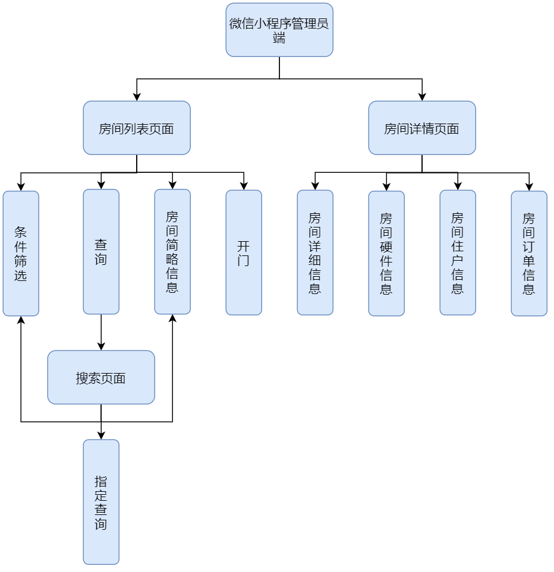

**房间列表页面：**

此页面包含四个功能模块：

条件筛选：条件筛选功能模块可以指定日期时间段（年-月-日 时:分 ~ 年-月-日 时:分）、指定房间类型进行房间筛选。

查询：搜索功能模块点击可以进入搜索界面。

房间简略信息：在房间列表页面视觉呈现占比最大的功能模块就是房间简略信息功能模块，此功能模块展示房间列表并在列表每一项展示房间简略信息（优先显示当前时间有入住客户的房间），此功能模块内展示数据因管理员身份而定。所有身份管理员（经理、前台、安保人员、清洁人员）都能看到的数据是房间内的温湿度和硬件状态，所有管理员拥有进入房间详情页面的权限，只有经理、安保和清洁人员拥有开门权限。房间列表页面列表展示的房间为条件筛选模块筛选结果，若未进行条件筛选，默认显示全部房间信息。

开门：开门功能模块在房间简略信息模块内，只有拥有开门权限的管理员（经理、安保人员、清洁人员）在管理员端微信小程序上能看到开门按钮并使用。开门改变房间数据表里锁的状态。

**搜索页面：**

此页面包含三个功能模块：

条件筛选：同上。

指定查询：此功能模块为搜索模块，在输入搜索关键字前可以选择搜索关键字类型（订单号、房间号、住户姓名）；搜索支持模糊搜索；搜索前置条件受条件筛选影响。

房间简略信息：同上。

**房间详情页面：**

此页面包含四个功能模块：

房间详情信息：此功能模块为管理员查询指定房间固有属性的展示功能模块。展示的房间信息有房间号、房间类型、房间床型、房间面积、居住人数上限、窗户有无、房间价格、温湿度。安保人员和清洁人员进入房间详情页面后只能查看房间详情信息。

房间硬件信息：此功能模块为管理员查询指定房间的配套硬件信息的展示功能模块。展示的硬件信息有硬件编号、硬件状态、硬件模式、硬件数值。

房间住户信息：此功能模块为管理员查询指定房间现住户个人信息的展示功能模块。展示的个人信息有住户姓名、住户性别、住户联系方式（手机号）、住户身份证号，其中住户身份证号不以明文方式展示，若要查看明文信息，需输入管理员账号密码进行身份验证才能查看。

房间订单信息：此功能模块为管理员查询指定房间现拥有的订单信息的展示功能模块。展示的订单信息有订单号、订金、应付金额、预计入住时间、预计离开时间、实际入住时间。

#### 微信小程序客户端

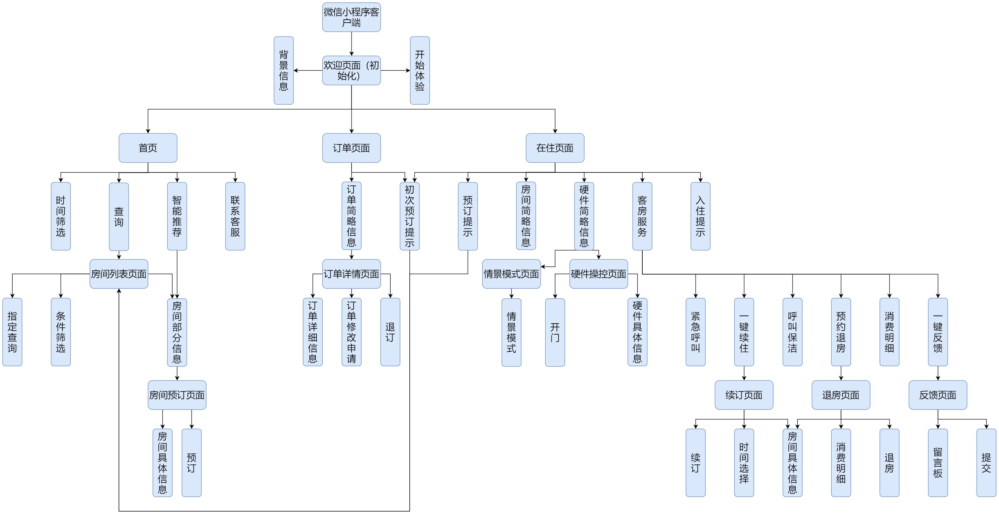

**欢迎界面（初始化）：**

此页面包含两个功能模块：

背景信息：此功能模块展示酒店的宣传海报图。

开始体验：此功能模块包含一个跳转到首页的按钮。

**首页：**

此页面包含三个功能模块：

时间筛选：此功能模块为客户提供简单的客房查询筛选条件，客户可以先选择大致时间段（年 月-日~月-日）

查询：此功能模块只有一个跳转按钮，可以通过按钮带值（来自时间筛选功能模块的已选时间段）跳转到房间列表页面。

智能推荐：此功能模块客户需要同意微信小程序自动获取部分个人信息，后台通过大数据算法对客户进行智能推荐。智能推荐的算法依据是后端根据用户预订记录和入住记录进行大数据分析，推算出用户可能感兴趣的房间类型，用户有效记录次数越多，智能推荐越精准，微信小程序会提示客户此问题，以免初次和低次体验此功能用户对此功能造成误解。

联系客服：此功能模块为用户提供联系客服的渠道。

**订单页面：**

此页面包含两个功能模块：

预订提示（初始化）：此功能模块展示给一次也未预定过房间的客户，展示信息为无订单信息的提示和跳转到房间列表页面的按钮。

订单简略信息：此功能模块展示给已预定房间的客户，展示信息为用户不同类型的订单简略信息，包括已退订、已过期、已预订、进行中的订单信息，以时间轴的方式展示，不同类型的订单展示色彩不同，以方便客户区分。点击订单简略信息名片即可进入订单详情页面。

**在住页面：**

此页面包含六个功能模块：

预订提示（初始化）：此功能模块展示给一次也未预定过房间的客户，展示信息为无待入住房间的提示和跳转到房间列表页面的按钮。

预订提示：此功能模块展示给拥有非“已预订”类型订单的客户，展示信息为无待入住房间的提示和跳转到房间列表页面的按钮。

入住提示：此功能模块展示给拥有“已预订”类型订单的客户，展示信息为所有已预订房间的未入住提示、房间号、房间类型，多房间采用列表翻页的方式展示，每个轮播图上都有入住房间的按钮（未到预计入住时间按钮禁用），点击按钮会询问客户是否确定入住，客户自行选择。

房间简略信息：此功能模块展示给拥有“进行中”类型订单的客户，展示信息为房间简略信息，包括房间号、房间温湿度、硬件状态、硬件模式、硬件数值。

硬件简略信息：此功能模块展示给所有客户，展示信息为房间硬件（门锁、空调、灯），只有拥有“进行中”类型订单的客户才能通过点击进行开门、进入硬件操控页面和选择不同的情景模式，点击不同硬件按钮进入的硬件操控页面不同。

客房服务：此功能模块展示给所有客户，展示信息为酒店暂时提供的六项客房服务（紧急呼叫、一键续住、呼叫保洁、预约退房、一键反馈）的按钮，只有拥有“进行中”类型订单的客户才能享受酒店客房服务。点击紧急呼叫模块会调用手机拨号功能，可以直接向酒店工作人员进行电话通信；点击一键续住模块会跳转到续订页面；点击呼叫保洁模块，后台会向清洁人员进行通知；点击预约退房模块会跳转到退房页面；点击消费明细模块会在微信小程序的底部上弹消费明细列表，列表信息包括消费项目、消费时间、消费金额。点击一键反馈模块会跳转到反馈页面。

**房间列表页面：**

此页面包含三个功能模块：

条件筛选：此功能模块让客户筛选出指定房间。筛选条件包括时间段（年-月-日 时:分 ~ 年-月-日 时:分）和房间类型。

指定查询：此功能模块为搜索功能模块，让客户指定查询房间。搜索支持模糊搜索；搜索前置条件受条件筛选影响。

房间部分信息：此功能模块展示房间列表并在列表每一项展示房间部分信息。展示的房间部分信息包括房间照片、房间类型、房间床型、限住人数、房间价格。房间列表展示的房间为条件筛选模块筛选结果，若未进行条件筛选，默认显示全部房间信息。

**订单详情页面：**

此页面包含三个功能模块：

订单详细信息：此功能模块展示客户订单的详细信息。展示的订单详细信息包括订单号、客户姓名、性别、联系方式、房间号、房间类型、房间床型、订金、应付金额、预计入住时间、预计离开时间、实际入住时间、实际离开时间、订单状态。

订单修改申请：此功能模块让客户可以修改订单详细信息里的预计入住时间、预计离开时间，包含一个申请修改按钮。客户点击按钮，等可选时间范围返回后客户进行修改，客户可以修改手机号、预计入住时间和预计离开时，修改完成后提交修改申请，微信小程序询问是够确定修改，用户自行选择。若选择确定修改，则后台确认后更新订单数据表；若选择放弃修改，则订单数据表里的属性值原封不动。

退订：此功能模块让客户可以放弃订单，包含一个退单按钮。用户点击按钮后微信小程序会询问是够确定退单。若确定退单，则订单数据表的订单状态改为“已失效”；若取消退单，则无改变。

**模式页面：**

此页面包含一个功能模块：

情景模式：此功能模块让用户选择不同的房间情景模式，包含四个情景按钮（影院模式、会议模式、夜间模式、睡眠模式）。选择不同模式，房间硬件属性会随之调整。影院模式下灯关闭；会议模式下灯进入照明模式，且亮度自动上升一个度；夜间模式下灯进入夜间模式；睡眠模式下灯进入睡眠模式。所有模式下空调温度根据室内温度进行调整，空调模式根据所处环境进行调整，空调属性调整依赖所处地区环境和气候。情景模式选择导致的硬件属性变化优先级低于客户手动调节。情景模式的选择改变硬件数据表的硬件状态、硬件模式、硬件数值。

**硬件操控页面：**

此页面包含两个功能模块：

硬件具体信息：此功能模块展示房间内硬件的具体信息，展示的硬件具体信息包括硬件图标、硬件状态、硬件模式、硬件数值，其中硬件硬件状态、硬件模式和硬件数值客户可以进行手动调整，如升高空调温度、关灯。不同灯光模式下灯光亮度随之改变，标准照明灯光亮度为6、夜间模式灯光亮度为3、睡眠模式灯光亮度为1，起夜模式灯光亮度为2，影院模式灯光亮度为0。灯光模式选择导致的亮度变化优先级低于客户手动调节。

开门：此功能模块让客户一键开门，包含一个开门按钮。点击按钮后开启门锁。开门改变房间数据表里锁的状态。

**房间预订页面：**

此页面包含两个功能模块：

房间具体信息：此功能模块展示房间的具体信息。展示的房间具体信息包括房间号、房间类型、床型、智能硬件种类、面积、限住人数、窗户有无。

预订：此功能模块让客户填写个人信息和订单信息，包含客户照片上传、姓名填写、性别选择、联系手机填写、预订入住时间选择、预订离开时间选择、价格、明细、和一个预订按钮。用户填写完上述个人信息和订单信息后点击按钮预订，微信小程序会询问客户是否确定预订。如果确定预订，则人信息和订单信息分别填入用户数据表和订单数据表；如果取消预订，则两个数据表不变动。

**续订页面：**

此页面包含三个功能模块：

房间具体信息：同上。

时间选择：此功能模块让客户选择续住到哪个时间点，续订最晚截止到此房间下一个被预定时间段的前一个小时。续订最晚截止时间每隔5s进行一次刷新。

续订：此功能模块仅包含一个续订按钮。客户点击续订按钮后，微信小程序会询问客户是否确定预订。如果确定续订，后台对续订最晚截止时间进行确认，无冲突则订单数据表中的预计离开时间属性值更新；如果取消续订，则订单数据表不变动。

**退房页面：**

此页面包含三个功能模块：

房间具体信息：同上。

消费明细：此功能模块展示客户在酒店内的所有消费记录。展示的消费明细包括消费项目、消费时间、消费金额。

退房：此功能模块仅包含一个退房按钮。客户点击退房按钮后，微信小程序会询问客户是否确定退房。如果确定退房，则由退房确定事件获取的时间填入订单数据表中的实际离开时间属性中；如果取消退房，则订单数据表不变动。

**反馈页面：**

此页面包含两个功能模块：

留言板：此功能模块仅包含一个多行文本输入框。客户可以将自己的建议留言下来。

提交：此功能模块包含两个按钮——提交/撤销。在客户点击提交按钮后，提交按钮会变成撤销按钮并伴随7s倒计时，留给客户撤销发言的机会，7s过后自动提交。信息提交以匿名的方式提交。

### 系统界面设计

#### 网页端

#### 微信小程序管理员端

**色彩设计：**

管理员端微信小程序的主题色采用的是渐变色：蓝色(#0286F8) ~ 青色(#1CBAB7)，考虑到管理员会长时间使用管理员端微信小程序，故色彩主题色调设为蓝色，渐变色对主题色彩的色彩复杂度影响不高，不易造成审美疲劳。

**风格设计：**

因管理员端直接展示信息不多，故所需主页面很少，实际意义上的管理员主页面只有一页。为避免单主页面导致设计单一化，主页面风格采用大幅度的动画处理，增加页面设计张力，拓宽单主页面的表张范围。将另一页面的信息展示放在主页面的扩展侧页上，利用大幅度，在设计上实现单页面上的多页面层级化，使程序更立体。进入内部子页面后不需要过分张力，风格区域流畅化、简单化。

各功能趋向于模块化。不同数据表的信息展示进行模块化独立，使得管理员端微信小程序面对不同管理员权限的酒店工作人员可以更轻松地在展示信息：将展示信息模块化后可以通过对模块的显示、隐蔽、选择性展示实现对不同权限的管理员的信息展示。

**房间列表页面：**

概念图：

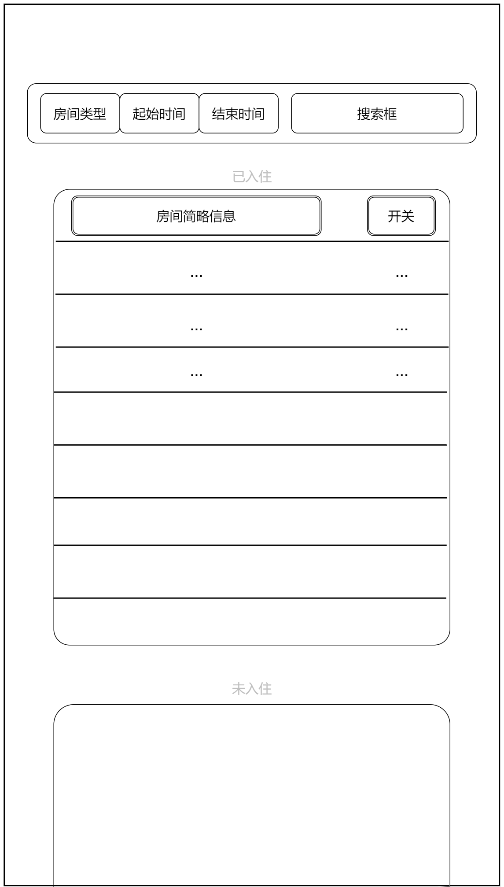

**房间详情页面：**

概念图：

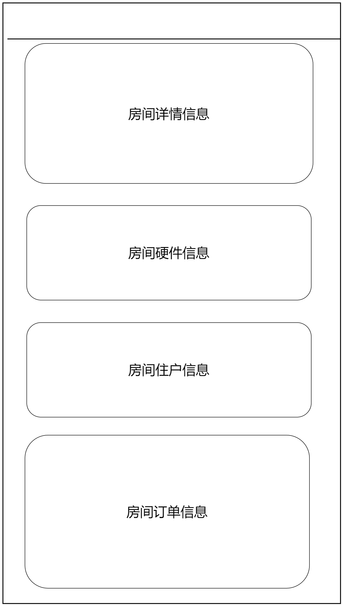

**搜索页面：**

概念图：

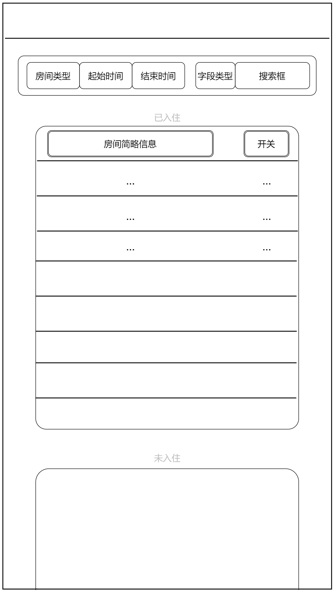

#### 微信小程序客户端

**色彩设计：**

客户端微信小程序的主题色采用的是青色(#13C2C2)，少量界面为渐变色或混合色，主题色仍是单色。选此色号的青色会带个人清新、简约的感觉。

**风格设计：**

客户端小程序的展示信息颇多，子页面也颇多。如果设计风格为寻求张力，把握不好会致使客户端小程序看起来凌乱冗余，所以客户端微信小程序的设计风格应该内敛或是简约，采用流畅过场和动画，使得各子页面流畅衔接，浑然一体。在逻辑上设计页面对接时要避免微信小程序页面扁平化，通过逻辑设计的页面跳转要体现层次性和深度。

此次项目中。客户端小程序信息展示要遵守的原则是“设计模块化整合、展示模块化整合、信息来源不模块化单一”。原则前两者可以一起实施，设计风格不采用传统平面信息罗列式，而是采用模块化独立于平面上，每个待展示的数据集可以在模块内继承展示。

在设计上追求一些立体、在信息展示上追求一些集合。

而息来源不模块化单一是为了更好的进行信息展示，统一展示的数据集不全是出自一个数据源，更多的是多数据源联合体呈现数据集，只有多元化整合信息才能保证信息能够协调地模块化展示，更突出的体现设计的立体感。

**欢迎页面：**

初始化的欢迎页面设计风格应该偏简约，所以动画设计不用过于复杂浮夸，背景图静态就好。

概念图：

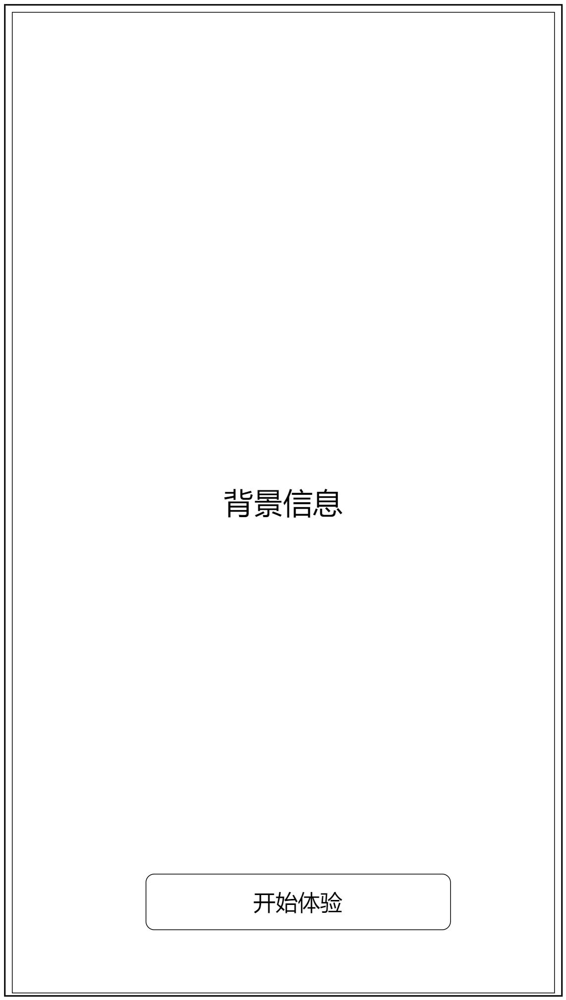

**首页：**

概念图：

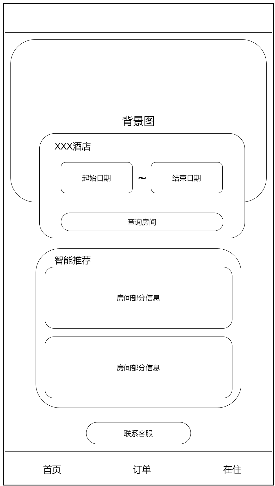

**订单页面：**

订单页面有两种页面，一种是展示给一次都没有预定房间的客户。

概念图：

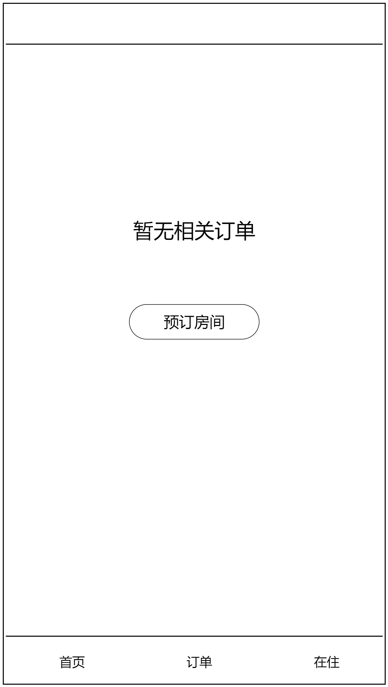

一种是展示给一次都没有预定房间的客户。

概念图：

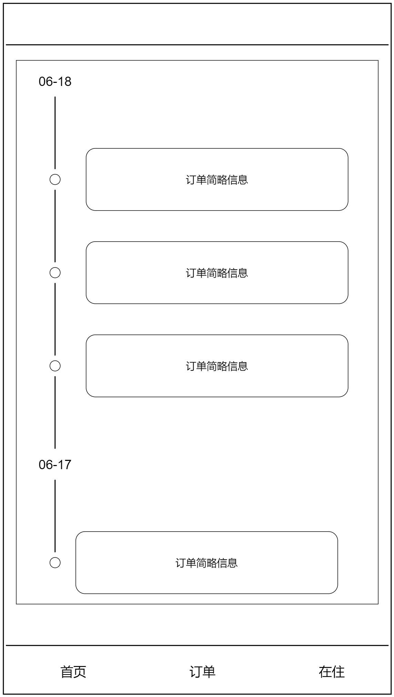

**在住页面：**

在住页面有两种页面，一种是展示给没有待入住房间的客户。

概念图：

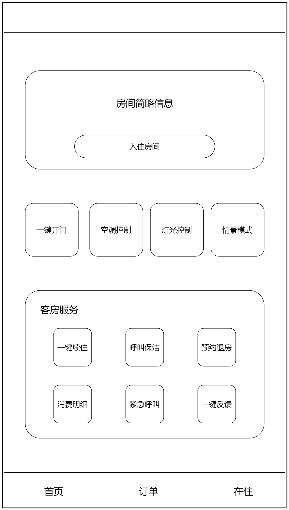

在住页面有两种页面，一种是展示给拥有待入住房间的客户。

概念图：

**房间列表页面：**

概念图：

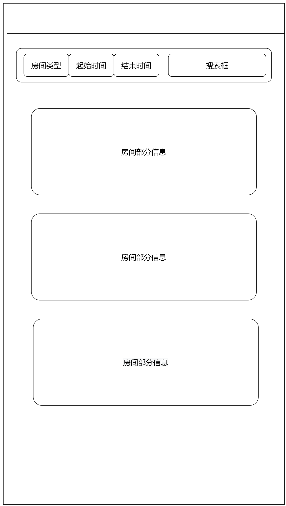

**订单详情页面：**

概念图：

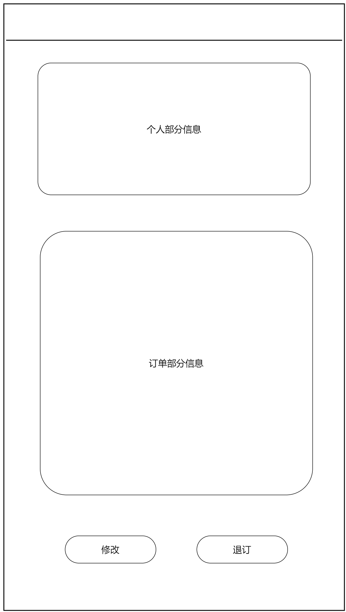

**模式页面：**

在模式页面内选定不同的模式，页面背景图/色会发生变化。影院模式背景颜色变暗，背景图换作影院图片；会议模式背景颜色变亮，背景图换做会议桌图片；夜间模式背景颜色变暗，背景图换作星空图片；睡眠模式背景颜色变暗，背景图换作月亮图片。亮度的升降参考灯的标准照明模式亮度

概念图：

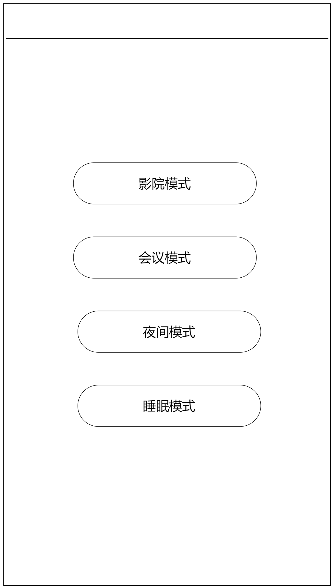

**硬件操控页面：**

智能硬件有两类，分别是空调和灯。

空调在切换模式的时候（制热、吹风、制冷），空调图标会同步转变成不同模式的颜色。

概念图：

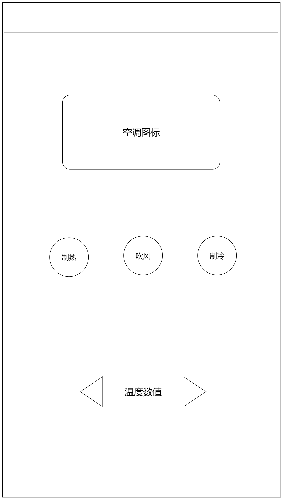

灯在切换模式的时候（标准照明、夜间模式、睡眠模式、起夜模式、影院模式），灯图标会同步转变成不同模式的颜色。

概念图：

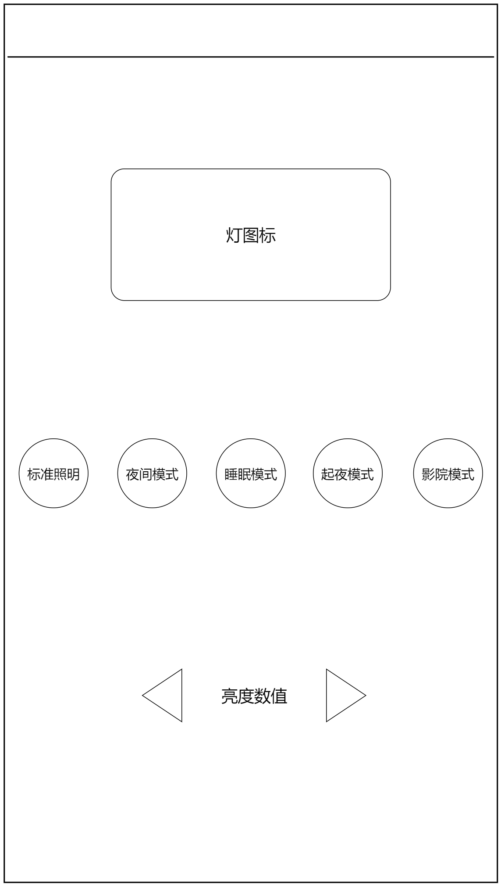

**房间预订页面：**

概念图：

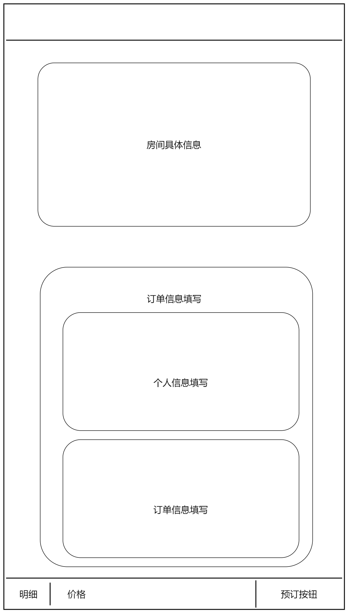

**续订页面：**

概念图：

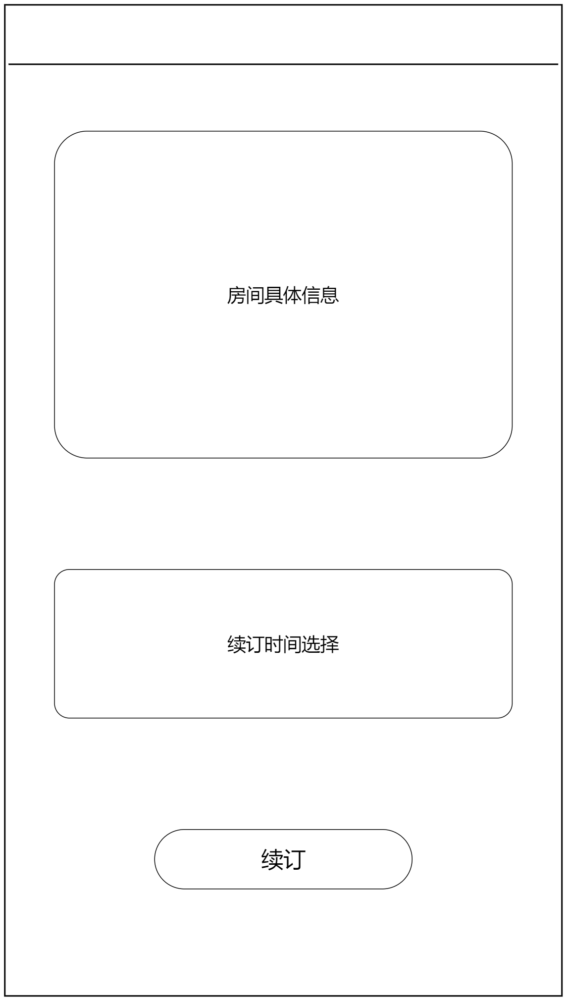

**退房页面：**

概念图：

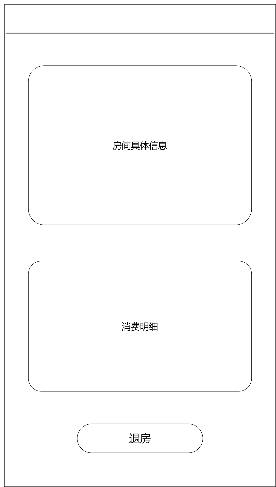

**反馈页面：**

按钮在显示提交的时候为主题色青色，在显示撤销倒计时按钮时按钮变为红色。

概念图：

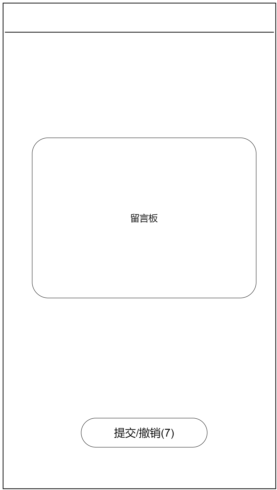

### 系统接口设计

#### 网页端

#### 微信小程序端

