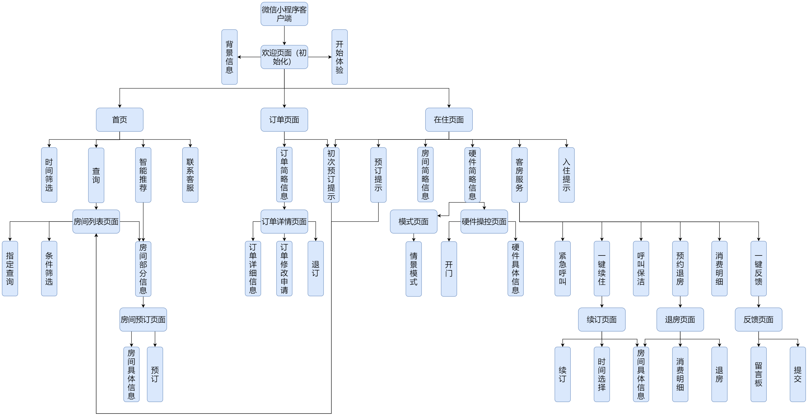

## 详细设计

在前两章中，主要分析了智慧酒店系统的需求与设计。在本章中，则重点叙述智慧酒店系统的具体实现。详细介绍一些重点模块的界面和业务逻辑实现方法，以及数据库的具体连接方法。

### 系统功能设计

（功能设计图；具体描述不同端不同页面的具体功能实现步骤）

#### 网页端

#### 微信小程序管理员端

**房间列表页面：**

此页面包含四个功能模块：

条件筛选：条件筛选功能模块可以指定日期时间段（年-月-日 时:分 ~ 年-月-日 时:分）、指定楼层数、指定房间类型进行房间筛选。

查询：搜索功能模块点击可以进入搜索界面。

房间简略信息：在房间列表页面视觉呈现占比最大的功能模块就是房间简略信息功能模块，此功能模块展示房间列表并在列表每一项展示房间简略信息（优先显示当前时间有入住客户的房间），此功能模块内展示数据因管理员身份而定。所有身份管理员（经理、前台、安保人员、清洁人员）都能看到的数据是房间内的温湿度和硬件状态，所有管理员拥有进入房间详情页面的权限，只有经理、安保和清洁人员拥有开门权限。房间列表页面列表展示的房间为条件筛选模块筛选结果，若未进行条件筛选，默认显示全部房间信息。

开门：开门功能模块在房间简略信息模块内，只有拥有开门权限的管理员（经理、安保人员、清洁人员）在管理员端微信小程序上能看到开门按钮并使用。开门改变房间数据表里锁的状态。

**搜索页面：**

此页面包含三个功能模块：

条件筛选：同上。

指定查询：此功能模块为搜索模块，在输入搜索关键字前可以选择搜索关键字类型（订单号、房间号、住户姓名）；搜索支持模糊搜索；搜索前置条件受条件筛选影响。

房间简略信息：同上。

**房间详情页面：**

此页面包含四个功能模块：

房间详情信息：此功能模块为管理员查询指定房间固有属性的展示功能模块。展示的房间信息有房间号、房间类型、房间床型、窗户有无、房间价格、温湿度。

房间硬件信息：此功能模块为管理员查询指定房间的配套硬件信息的展示功能模块。展示的硬件信息有硬件名称、硬件状态、硬件模式、硬件数值。

房间住户信息：此功能模块为管理员查询指定房间现住户个人信息的展示功能模块。展示的个人信息有住户姓名、住户性别、住户联系方式（手机号）、住户身份证号，其中住户身份证号不以明文方式展示，若要查看明文信息，需输入管理员账号密码进行身份验证才能查看。

房间订单信息：此功能模块为管理员查询指定房间现拥有的订单信息的展示功能模块。展示的订单信息有订单号、订金、应付金额、预计入住时间、预计离开时间、实际入住时间。

#### 微信小程序客户端

**欢迎界面（初始化）：**

此页面包含两个功能模块：

背景信息：此功能模块展示酒店的宣传海报图。

开始体验：此功能模块包含一个跳转到首页的按钮。

**首页：**

此页面包含三个功能模块：

时间筛选：此功能模块为客户提供简单的客房查询筛选条件，客户可以先选择大致时间段（年 月-日~月-日）

查询：此功能模块只有一个跳转按钮，可以通过按钮带值（来自时间筛选功能模块的已选时间段）跳转到房间列表页面。

智能推荐：此功能模块客户需要同意微信小程序自动获取部分个人信息，后台通过大数据算法对客户进行智能推荐。智能推荐的算法依据是后端根据用户预订记录和入住记录进行大数据分析，推算出用户可能感兴趣的房间类型，用户有效记录次数越多，智能推荐越精准，微信小程序会提示客户此问题，以免初次和低次体验此功能用户对此功能造成误解。

联系客服：此功能模块为用户提供联系客服的渠道。

**订单页面：**

此页面包含两个功能模块：

预订提示（初始化）：此功能模块展示给一次也未预定过房间的客户，展示信息为无订单信息的提示和跳转到房间列表页面的按钮。

订单简略信息：此功能模块展示给已预定房间的客户，展示信息为用户不同类型的订单简略信息，包括已退订、已过期、已预订、入住中的订单信息，以时间轴的方式展示，不同类型的订单展示色彩不同，以方便客户区分。点击订单简略信息名片即可进入订单详情页面。

**在住页面：**

此页面包含六个功能模块：

预订提示（初始化）：此功能模块展示给一次也未预定过房间的客户，展示信息为无待入住房间的提示和跳转到房间列表页面的按钮。

预订提示：此功能模块展示给拥有非“已预订”类型订单的客户，展示信息为无待入住房间的提示和跳转到房间列表页面的按钮。

入住提示：此功能模块展示给拥有“已预订”类型订单的客户，展示信息为所有已预订房间的未入住提示，多房间采用轮播图的方式展示，每个轮播图上都有未入住提示和入住房间的按钮，点击按钮会询问客户是否确定入住，客户自行选择。

房间简略信息：此功能模块展示给拥有“入住中”类型订单的客户，展示信息为房间简略信息，包括房间号、房间温湿度、硬件状态。

硬件简略信息：此功能模块展示给所有客户，展示信息为房间硬件（门锁、空调、灯）和情景模式选择的按钮，只有拥有“入住中”类型订单的客户才能通过点击进行开门、进入硬件操控页面和选择不同的情景模式，点击不同硬件按钮进入的硬件操控页面不同。

客房服务：此功能模块展示给所有客户，展示信息为酒店暂时提供的六项客房服务（紧急呼叫、一键续住、呼叫保洁、预约退房、消息明细、一键反馈）的按钮，只有拥有“入住中”类型订单的客户才能享受酒店客房服务。点击紧急呼叫模块会调用手机拨号功能，可以直接向酒店工作人员进行电话通信；点击一键续住模块会跳转到续订页面；点击呼叫保洁模块，后台会向清洁人员进行通知；点击预约退房模块会跳转到退房页面；点击消费明细模块会在微信小程序的底部上弹消费明细列表，列表信息包括消费项目、消费时间、消费金额。点击一键反馈模块会跳转到反馈页面。

**房间列表页面：**

此页面包含三个功能模块：

条件筛选：此功能模块让客户筛选出指定房间。筛选条件包括时间段（年-月-日 时:分 ~ 年-月-日 时:分）和房间类型。

指定查询：此功能模块为搜索功能模块，让客户指定查询房间。搜索支持模糊搜索；搜索前置条件受条件筛选影响。

房间部分信息：此功能模块展示房间列表并在列表每一项展示房间部分信息。展示的房间部分信息包括房间类型、房间床型、限住人数、房间价格。房间列表展示的房间为条件筛选模块筛选结果，若未进行条件筛选，默认显示全部房间信息。

**订单详情页面：**

此页面包含三个功能模块：

订单详细信息：此功能模块展示客户订单的详细信息。展示的订单详细信息包括订单号、客户姓名、性别、联系方式、预计入住时间、预计离开时间、实际入住时间、实际离开时间。

订单修改申请：此功能模块让客户可以修改订单详细信息里的预计入住时间、预计离开时间、实际入住时间、实际离开时间，包含一个申请修改按钮。客户点击按钮，等可选时间范围返回后客户进行修改，客户修改完成后提交修改申请，微信小程序询问是够确定修改，用户自行选择。若选择确定修改，则后台确认后订单数据表里的四个时间属性值修改为客户选定值；若选择放弃修改，则订单数据表里的属性值原封不动。

退订：此功能模块让客户可以放弃订单，包含一个退单按钮。用户点击按钮后微信小程序会询问是够确定退单。若确定退单，则订单数据表的订单状态改为“已失效”；若取消退单，则无改变。

**模式页面：**

此页面包含一个功能模块：

情景模式：此功能模块让用户选择不同的房间情景模式，包含四个情景按钮（影院模式、会议模式、夜间模式、睡眠模式）。选择不同模式，房间硬件属性会随之调整。影院模式下灯关闭；会议模式下灯进入照明模式；夜间模式下灯进入夜间模式；睡眠模式下灯进入 睡眠模式。所有模式下空调温度根据室内温度进行调整，空调模式根据所处环境进行调整，空调属性调整依赖所处地区环境和气候。情景模式选择导致的硬件属性变化优先级低于客户手动调节。情景模式的选择改变硬件数据表的硬件状态、硬件模式、硬件数值。

**硬件操控页面：**

此页面包含两个功能模块：

硬件具体信息：此功能模块展示房间内硬件的具体信息，展示的硬件具体信息包括硬件图标、硬件状态、硬件模式、硬件数值，其中硬件硬件状态、硬件模式和硬件数值客户可以进行手动调整，如升高空调温度、关灯。不同灯光模式下灯光亮度随之改变，标准照明灯光亮度为6、夜间模式灯光亮度为3、睡眠模式灯光亮度为1，起夜模式灯光亮度为2，影院模式灯光亮度为0。灯光模式选择导致的亮度变化优先级低于客户手动调节。

开门：此功能模块让客户一键开门，包含一个开门按钮。点击按钮后开启门锁。开门改变房间数据表里锁的状态。

**房间预订界面：**

此页面包含两个功能模块：

房间具体信息：此功能模块展示房间的具体信息。展示的房间具体信息包括房间号、房间类型、床型、智能硬件种类、面积、限住人数、窗户有无、价格。

预订：此功能模块让客户填写个人信息和订单信息，包含客户照片上传、姓名填写、性别选择、联系手机填写、预订入住时间选择、预订离开时间选择和一个预订按钮。用户填写完上述个人信息和订单信息后点击按钮预订，微信小程序会询问客户是否确定预订。如果确定预订，则人信息和订单信息分别填入用户数据表和订单数据表；如果取消预订，则两个数据表不变动。

**续订页面：**

此页面包含三个功能模块：

房间具体信息：同上。

时间选择：此功能模块让客户

### 系统界面设计

（阐述不同端的总体界面设计元素（如主题色）；配合简略图，简单表达不同端的不同页面；）

#### 网页端

#### 微信小程序管理员端

#### 微信小程序客户端

### 系统接口设计

#### 网页端

#### 微信小程序端

