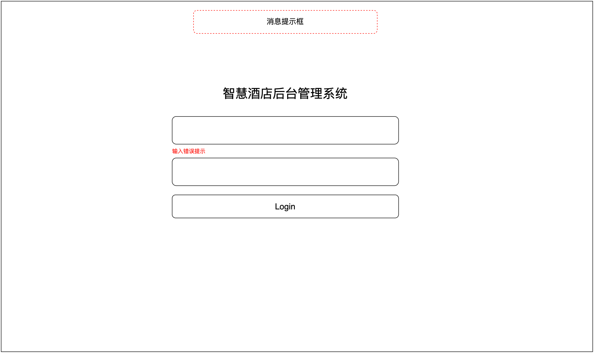
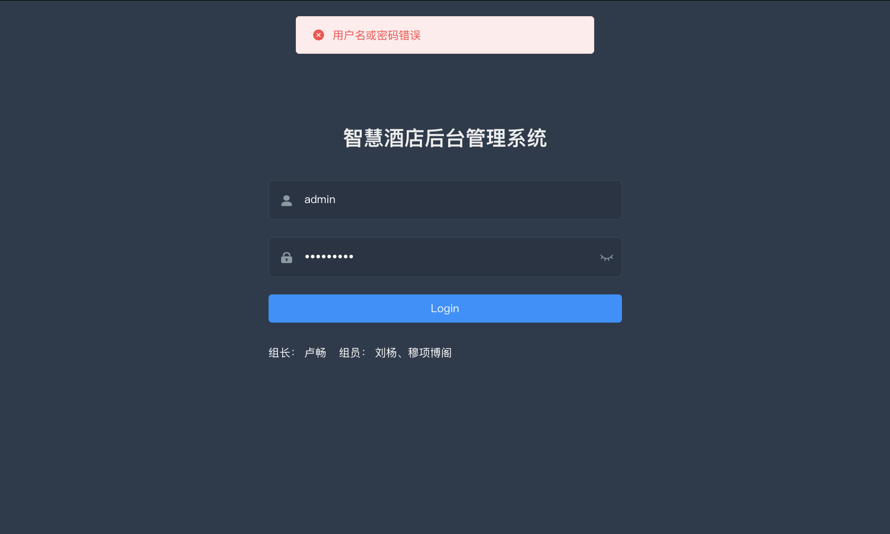
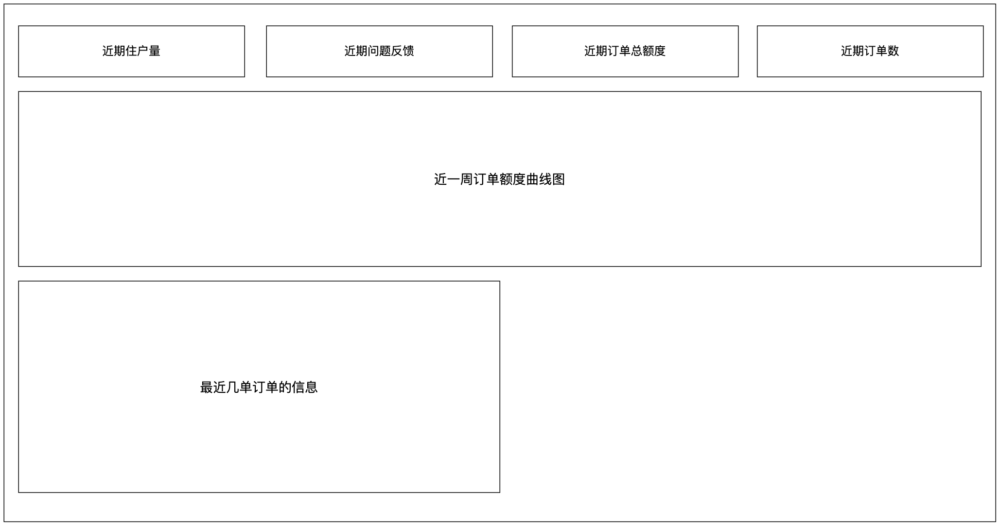
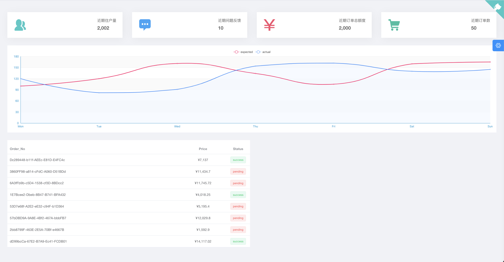
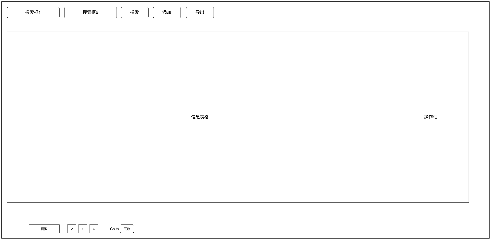
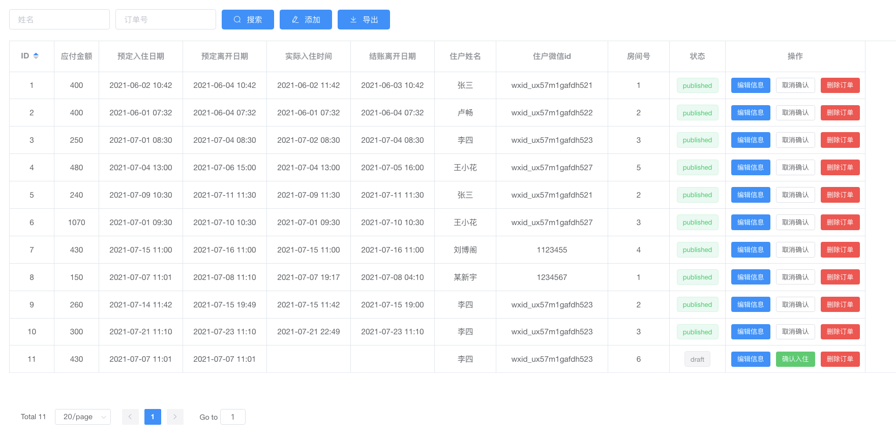
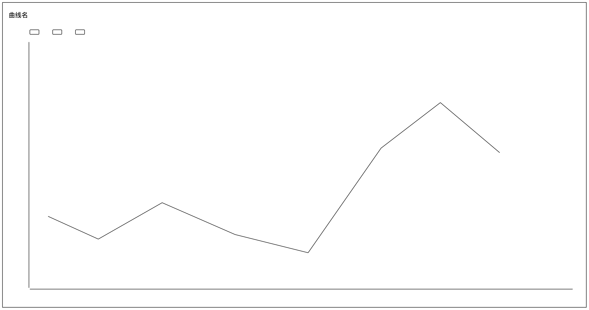
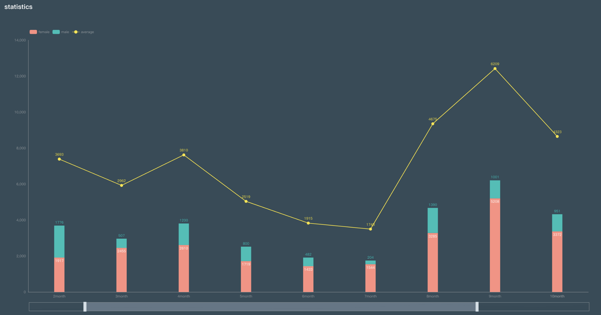

## 详细设计

在前两章中，主要分析了智慧酒店系统的需求与设计。在本章中，则重点叙述智慧酒店系统的具体实现。详细介绍一些重点模块的界面和业务逻辑实现方法，以及数据库的具体连接方法。

### 系统功能设计

由于本系统功能模块繁多，在本文档将不一一叙述其界面设计及算法实现，因此选取一些重要界面来叙述后台的代码实现

#### 网页端

（1）网页端登录界面

提供网页端用户登录的接口。用户可以在此界面中使用管理员账号登录。登录时密码位数要求不低于5位。登录成功后后端返回token数据，前端将token存储到Cookie当中用作身份验证信息。

（2）网页端统计信息预览界面

提供网页端统计信息预览界面。展示近期住户量，近期问题反馈数量，近期订单总额和近期订单总数。同时将近一周的金额以曲线图的形式进行展示。在计算近期住户量时后端通过查询近一周内的订单信息对住户人数进行求和后得到近期住户量。在计算近期问题反馈数量时，后端通过查询意见反馈数据表中近一周内的问题总数作为近期问题反馈数量。在计算近期订单总额度时，后端通过查询近一周内所有订单的额度进行求和得到近期订单总额度。

近一周金额曲线展示了近一周内每一天的订单金额。后端在通过数据库查询后按照API文档中规定的格式返回给前端，前端使用自定义组件LineChart进行展示。

（3）网页端统计曲线查看界面

以曲线的形式展示近两周内的订单金额详细信息。前端使用自定义表格组件MixChart进行展示数据。后端根据API文档要求查询订单数据表和用户数据表返回近两周内每一天的订单总金额，订单中男住户产生的金额与订单中女住户产生的金额也一并返回。在计算订单中男/女住户产生的金额时以定订单的用户为准，如定订单的用户为男用户那么这个订单所产生的金额就算入男住户产生的金额当中。

（4）网页端订单管理界面

以表格的形式展示用户的订单。提供对订单的筛选、查询、增加、删除和修改功能。 对于订单的筛选功能，前端通过控制GET请求的参数，后端根据传递的参数使用模糊查询来进行订单数据的筛选。对于订单的增加功能，前端通过POST请求的方式将订单的数据发送到后端。后端先对数据进行规则检查，特别要检查有无SQL注入语句在确定订单数据无误后将数据插入到订单数据表中。对于订单的删除功能，后端根据订单id将该项数据的id_status项修改为0。

在订单管理界面中酒店前台人员还需要为客户记录实际入住时间和实际退房时间，在最初产生订单时订单数据的实际入住时间和实际退房时间为空。订单管理界面中前端有确认入住和确认退房的按钮，通过点击按钮即可将当前时间作为实际入住时间/实际退房时间。

#### 微信小程序管理员端

#### 微信小程序客户端

### 系统界面设计

####  网页端

（1）登录界面：提供管理系统的登录界面，界面要求简洁美观。对于输入错误在输入框下方以红色字体显示提升信息，对于不合规定的提交以上方弹窗的形式显示提升信息。

登录界面概念图如图所示：

登录界面效果图如图所示：

（2）首页：显示酒店近期内的统计数据，如近期入住人数、近期订单成交数、近期盈利额等。显示一周内的统计数据的变化曲线图。

首页概念图：

首页效果图：

（3）用户管理界面：以表格的形式展示各个用户的信息，如姓名、身份证号、权限登记等信息。并提供可以对数据进行增加、修改、筛选和删除的按钮或子页面。

用户管理界面概念图：

（4）订单信息管理界面：以表格的形式展示各个订单的信息，如订单编号、预计输住时间等信息。并提供可以对数据进行增加、修改、筛选和删除的按钮或子页面。

订单信息管理界面概念图：

订单信息管理界面效果图：

（5）酒店详细统计数据查看界面：以曲线图/柱状图的形式显示酒店近两周内的统计数据。统计数据包括近期订单金额、近期男住户交易量和近期女住户交易量。以天为单位对统计数据进行显示。

界面概要图：

界面详细图：

（6）房间信息管理界面：以表格的形式展示每个房间的信息，如房间号、房间价格、房间温度、房间湿度等信息。并提供可以对数据进行增加、修改、筛选和删除的按钮或子页面。

（7）用户建议界面：以表格的形式展示用户上传的建议。建议以匿名的方式提交，管理者只能看到提交的建议以及提交建议的时间。

#### 微信小程序管理员端

（1）酒店工作人员端

房间列表界面：展示房间列表模块，包括已入住且时间匹配的房间列表和其他房间列表。

个人信息界面：展示个人信息模块，不包含身份证信息；展示行为记录模块，如个人开门记录。

房间详情界面：展示房间信息模块，包含房间具体固定信息；展示个人信息模块，包含用户填写的个人信息，敏感信息模糊展示；展示订单信息模块，包含具体订单信息。

#### 微信小程序客户端

（1）酒店客户端

初始封面界面：未使用 过酒店小程序用户第一次进入小程序的欢迎界面，界面温馨舒适。

首页界面：展示简单房间筛选条件模块，配查询房间按钮；展示推荐模块，如“猜您喜欢”模块。

订单界面：为已下单用户展示已订订单信息模块，联系客服模块；为未下单用户展示提示信息模块，并展示房间列表页面跳转模块。

在住界面：展示房间信息模块，如房间用户、住宿时间等，仅对已下单且时间匹配的用户展示信息，未下单用户和已下单但时间不匹配的用户展示提示信息；展示开锁模块；展示智能硬件模块，如灯光、空调等；展示客房服务模块，如预约退房、紧急呼叫、呼叫保洁等。

房间类型界面：展示筛选模块，模块内包括入住的多项筛选选项；展示房间列表模块，默认情况下展示所有房间类型，跟随筛选条件展示匹配条件的房间类型列表。

预订界面：展示个人信息填写模块，填写预订订单时的个人信息。

智能硬件界面：展示硬件控制模块，以改变硬件属性，不同硬件拥有不同的硬件界面。

### 系统接口设计

#### 网页端

说明：接口数据全部以JSON数据格式进行传输。具体API接口说明请参考附录—网页API接口说明。

**统计数据相关接口：**

（1）获取一周内/两周内入住人数、订单成交数、盈利额和用户建议的数量

（2）获取每日的入住人数、订单成交数、盈利额和建议的数量

**用户信息管理相关接口：**

（1）获取用户数据表中的个人数据的接口

（2）像用户数据表中添加数据的接口

（3）修改用户数据表中的数据的接口

（4）删除用户数据表中的数据的接口

**订单信息管理相关接口：**

（1）获取订单数据表中的订单数据的接口

（2）像用订单数据表中添加数据的接口

（3）修改订单数据表中的数据的接口

（4）删除订单数据表中的接口

**房间信息管理相关接口：**

（5）获取房间数据表中的订单数据的接口

（6）像用房间数据表中添加数据的接口

（7）修改房间数据表中的数据的接口

（8）删除房间数据表中的接口

**管理员个人信息相关接口：**

（1）获取管理员个人信息的接口

**用户建议查看相关接口：**

（1）获取用户提交的建议的接口

（2）删除用户提交的建议的接口

#### 小程序端

说明：接口数据全部以JSON数据格式进行传输。具体API接口说明请参考附录—小程序API接口说明。

**用户信息管理相关接口：**

（1）住户提交个人数据到用户数据表中的接口

（2）获取用户数据表中的个人数据的接口

**订单信息管理相关接口：**

（1）获取订单数据表中的订单数据的接口

（2）删除订单数据表中的订单数据的接口

**房间信息管理相关接口：**

（1）获取房间数据表中的房间数据的接口

（2）获取开门记录数据表中的开门记录数据的接口

（3）修改订单数据表中的订单数据的接口

（4）改开门记录数据表中的开门记录数据的接口

**硬件信息管理相关接口：**

（1）获取硬件数据表中的硬件数据的接口

（2）修改硬件数据表中的硬件数据的接口

**系统信息管理相关接口：**

（1）获取用户唯一身份凭证的接口

（2）获取用户身份数据表中用户身份数据的接口

