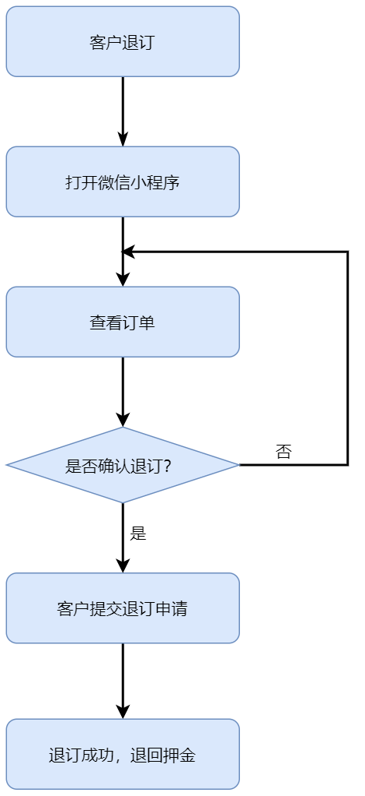
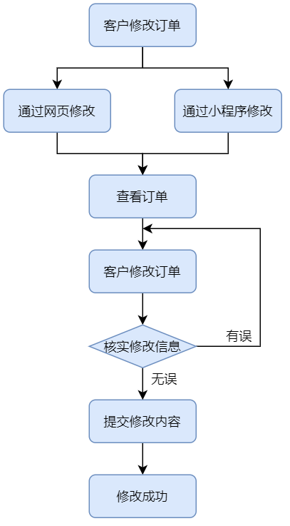

## 需求分析

### 行业背景

目前全国酒店行业发展开始趋于稳定，单纯继续发展酒店数量无法大跨度提 升酒店在市场中的竞争实力，所以现在酒店市场开始脱离量的变化，开始追求质的提升，而智慧酒店概念和体系的引入成为了酒店“升级”的热门选择。 就项目初开展地桂林而言，桂林是著名的旅游城市。从 2017 年至今，年游 客流量同比增长速率一直在 20%以上，随着国民经济水平的提高旅游业也得到了 空气的发展，桂林市政府也就旅游等服务业推出过《桂林市现代服务业发展“十 三五”规划》等鼓励政策。因此在旅游业发达且呈上升趋势的城市开展项目最适合不过了。

### 市场分析

#### 行业发展程度和动态

智慧酒店这个行业现如今是属于前景良好,资金投入中庸，发展速度近几年才快，整体来说是处于一种市场空缺大，但是做好并引领难的地步。现在的发展 动态是大型企业已经开始介入，智慧酒店市场再次掀起波澜，充满机遇但风险也高。

#### 创新和技术占比

在这个行业创新和技术始终扮演者重要角色，哪家公司的技术更新，更成熟，更有保障，无疑会成为竞争市场的有力手段。而创新不管是模式还是技术， 对于任何行业都是占比极大的一块。虽然智慧酒店行业发展方向和执行手段相差不会很大，但是商业模式的创新和对象选择的创新都是可以对改变市场格局的重要影响，所以创新和技术在智慧酒店这个行业中扮演者影响市场发展的角色之一。 

#### 行业资金投入和发展趋势 

目前全国主要城市的酒店智能化改造市场已经超过 1000 亿元，且每年酒店数量还有 20%左右的增长，这是酒店升质和提量的重要体现。除此之外，阿里巴巴等大型企业的资本投入必然会使智慧酒店行业的资金投入在未来持续增长，其资本透入也代表智慧酒店行业的发展开始走向飞速发展阶段。由此可以看出，未来10年内酒店智能系统应用前景非常广阔。 

####  经济发展和政府对该行业的影响 

智慧酒店行业的本质就是服务业，属于非必须发展对象，所以受经济影响比较大，但是对成型的智慧酒店影响不大，只是经济会影响酒店方面是否继续改造酒店的念头，进而影响整体行业的发展。在政府方面一直是积极鼓励的，因为智慧酒店在为酒店增益和升级的同时也是给当地城市的酒店行业提高品级和形象。为当地的经济发展做出贡献，尤其是对旅游业发达的地区，是提升当地旅游形象的 绝佳选择，因此政府一直都是鼓励智慧酒店的发展。

### 术语与定义

系统或平台：如果没有特别指出，则本文中述写的系统或者平台只指智慧酒店系统。

用户：指酒店管理员人员。

客户：指酒店的住户。

权限：允许用户操作应用信息系统中某功能点或功能点集合的权力范围。

角色：应用信息系统中用于描述用户权限特征的权限类别名称。

### 用户需求

用户希望通过使用智慧酒店系统得到所需信息，达到提高管理水平的目的，希望新系统具有以下功能：

新系统能够使用计算机快速处理日常的业务及相关数据，实现实时查询各种入住信息。

新系统能够实时的录入住宿单、换房单等的情况。

新系统能够实时查询客房信息、客人账单信息等的具体情况。

新系统能够建立客户的资料，方便日后建立良好的客户关系。

新系统能够保障数据的安全性：不同用户有对数据查看，修改等处理不同的权限。

新系统能够可以提供微信小程序平台的预定系统。用户可以在手机上进行房间的预定以及查看自己的房间信息、修改订单信息等。

新系统可以融入人工智能的元素，用户在预定房间时在手机上提交自己的照片。系统可以对人脸特征信息进行提取。到达酒店后可以使用人脸进行开门。

新系统可以与酒店中的智能硬件进行对接，用户可以在手机端操控智能硬件。

新系统可以提升酒店的安全性，实时监控各房间的温度与湿度信息。如若异常立即通知安保人员前往查看。

新系统中用户可以在手机端给酒店的服务提交建议，酒店管理员可以在网页端查看建议。

### 业务流程

智慧酒店的业务流程主要有客户预订、客户入住、客户结账离开、统计酒店业绩、导出业绩报表，这五大业务又由一些子业务实现，分别为客户预订、客户退订、客户入住、客户退房、客户修改订单、扫脸开门、意外应急处理、数据统计，系统总体业务流程图如下：

#### 客户预定流程

酒店客户可以在手机端预约酒店房间，预约流程图如下：

客户先打开微信小程序在房间预览界面选择房间，点击房间后可以查看房间的大小、价格等详细信息。如果不满意则返回重新选择房间。如果满意则填写个人信息进行预定，并支付押金同时生成订单信息。

#### 客户退订流程

酒店客户可以在微信小程序端退订酒店房间，退订流程图如下：

客户先打开微信小程序在我的房间界面选择自己的订单，如果确认退订则提示退订成功。

#### 客户入住流程

客户可以事先在微信小程序中进行预订房间，也可以来到酒店之后进行订房。当客户到达酒店时，前台人员会接待客户并询问客户是否在微信小程序上进行房间预定。如果没有则根据客户的订房需求引导客户在小程序端进行订房。如果已经预定则确认客户的订单。接下来确认客户证件的有效性，如果证件无效则禁止入住。如果证件有效则让客户核对房间信息，房间信息正确则登记用户的确认入住时间。登记完毕后引导客户进房。客户进行入住，在入住结束后缴费退房，入住流程如下：

#### 客户退房流程

当客户需要退房时需要到前台办理退房业务，前端确认订单信息后和客户进行确认订单信息。客户确认订单信息后进行缴费，退房成功。

#### 客户修改订单流程

酒店客户可以在微信小程序端修改自己的订单信息，修改订单流程图如下：

客户在微信小程序我的房间界面查看订单信息，如果需要对订单信息进行修改如进行续订或换房间等。在核实了修改信息无误后则可以提交修改内容。

#### 数据统计流程

系统会对每笔订单进行统计，会统计入住人数、订单信息、盈利额等数据，并对这些数据进行汇总收集，数据统计完成后，具有相关权限的管理员可以对统计出的数据进行查看，导出等操作，数据统计流程图如下：

#### 扫脸开门流程

客户可以在微信小程序端注册人脸信息，系统将自动将人脸信息保存到酒店人脸数据库。在到达酒店后客户可以通过扫脸的方式打开房门。当客户站在房门前的时候房门摄像头将采集人脸信息，系统将提取摄像头画面中的人脸特征信息。接下来在酒店人脸数据库中搜索人脸特征信息，如果搜索成功且该客户已确认预定该房间则人脸识别成功房门打开。

#### 意外应急处理流程

酒店内每个房间都配有温湿度检测器，如果检测器数值异常则会自动进入意外应急处理流程。流程图如下：

系统每隔一段时间会检测房间内的温湿度有没有异常，如果有异常（如温度过高可能是火灾）则发出警报，并记录房间的信息。同时通知房间的主人和最近的安保人员。安保人员在收到通知后在第一时间赶到异常房间进行处理，最后安保人员在最短的时间内成功解决故障。

### 数据分析

### 可靠性分析

故障的频率：故障频率低，严重性小。

可恢复性：软件突然崩溃或者发生错误后应该可以回滚到上一次的操作中，忽略当前此次操作。

可预见性：当点击某些控件时候，在会发生错误或者数据修改时候应当给与必要的提示。

### 可用性分析

人员因素：给不同人员分配不同的系统权限。

用户界面需求：界面美观，便于操作。

用户文档和培训材料：在提交软件时期应该附带用户文档以及必要的培训材料,以使得财务人员可以更快的适应新的软件。

### 安全需求

#### 用户安全性需求

1. 在传输用户敏感性数据时数据都是经过加密后传输，双方还会就传输数据源进行身份确认。
2. 管理系统内设置不同级别用户，不同级别用户拥有不同权限。除开系统的超级管理员权限，不同管理员权限范围不一，只有拥有涉及处理用户个人信息工作职能的管理员才有查看用户个人信息。
3. 酒店内不使用实体房卡或钥匙，充分保证住户开门权限的主权，避免因丢失钥匙等物理因素导致的开门主权受制，从而致使用户安全问题。

#### 密码安全性需求

1. 设置密码位数要求和数据类型要求，设置最低位数要求，充分避免密码弱口令。
2. 设置登录限制机制，设置账号密码输入检测次数限制，在达到一定错误次数后，再次尝试会伴随验证机制。在伴随验证机制的前提下再达到一定次数后会进行登录锁定。
3. 密码在系统内从不以明文方式展示。

#### 系统安全性需求

系统保密性：只有授权的用户才能动用和修改信息系统的信息，且必须防止信息的非法修改和未授权泄漏。

系统完整性：信息必须以其原形被授权的用户所用只有授权的用户才能修改信息。

可用性与抗毁性：设置备份系统、容错机制，防止在系统出现单点失败时，系统的备份机制可以保证系统的正常运行。

系统防病毒：定时对系统进行安全扫描，发现病毒后及时清除。

#### 服务安全性需求

对于管理系统和微信小程序的后端服务器，检查有无高危端口，关闭不必要端口对端口进行放行限制。使用端口扫描器扫描系统已开放的端口，分析统计系统开放的哪些服务可能引起黑客入侵，实时监控这些端口状态。设置好安全记录的访问权限。安全记录在默认情况下是没有保护的，把它设置成只有管理员和系统账户才有权访问。

对于微信小程序对外开放的后端接口，每次访问需对用户身份进行校验，且数据包数据需具有时效性。身份验证通过时间戳加密钥等技术实现数据包不可重复发送。避免恶意抓包导致的信息泄漏、越权等问题。

 