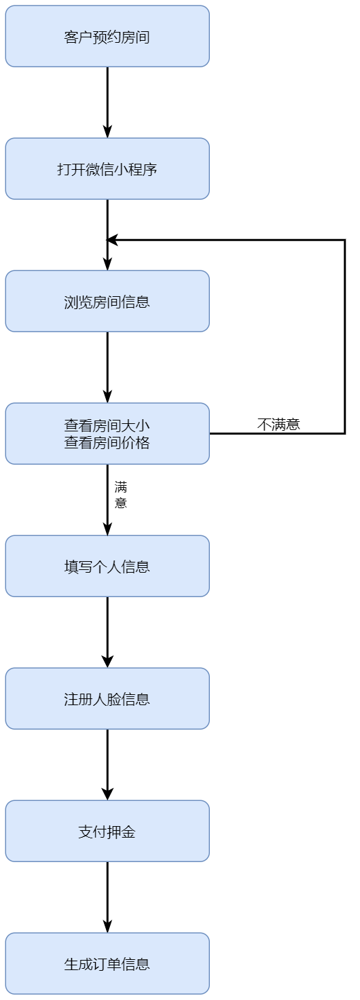
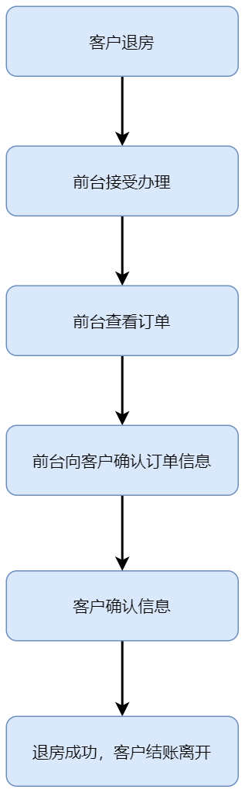
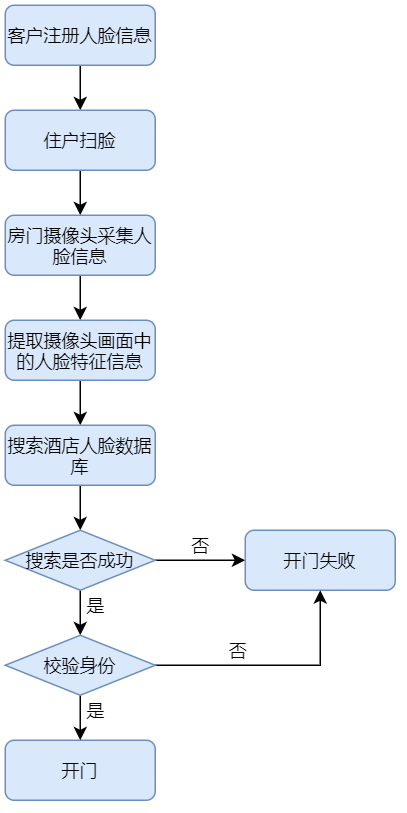
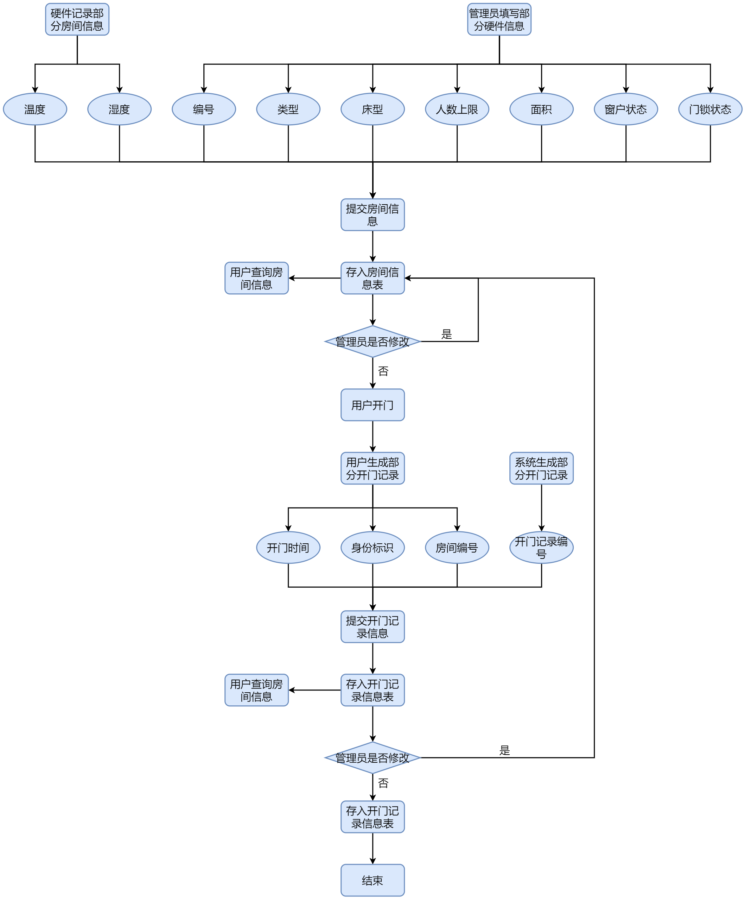
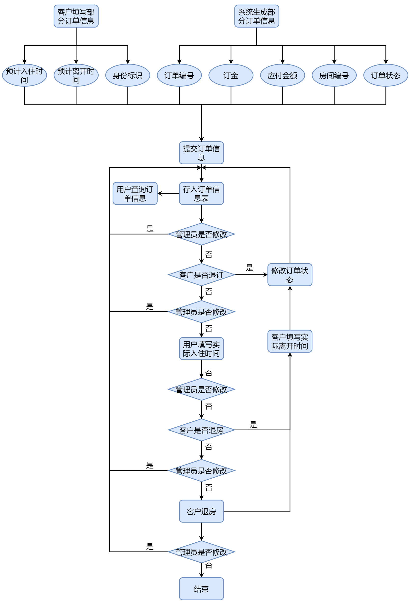

## 需求分析

### 行业背景

目前全国酒店行业发展开始趋于稳定，单纯继续发展酒店数量无法大跨度提 升酒店在市场中的竞争实力，所以现在酒店市场开始脱离量的变化，开始追求质的提升，而智慧酒店概念和体系的引入成为了酒店“升级”的热门选择。 就项目初开展地桂林而言，桂林是著名的旅游城市。从 2017 年至今，年游 客流量同比增长速率一直在 20%以上，随着国民经济水平的提高旅游业也得到了 空气的发展，桂林市政府也就旅游等服务业推出过《桂林市现代服务业发展“十 三五”规划》等鼓励政策。因此在旅游业发达且呈上升趋势的城市开展项目最适合不过了。

### 市场分析

#### 行业发展程度和动态

智慧酒店这个行业现如今是属于前景良好,资金投入中庸，发展速度近几年才快，整体来说是处于一种市场空缺大，但是做好并引领难的地步。现在的发展 动态是大型企业已经开始介入，智慧酒店市场再次掀起波澜，充满机遇但风险也高。

#### 创新和技术占比

在这个行业创新和技术始终扮演者重要角色，哪家公司的技术更新，更成熟，更有保障，无疑会成为竞争市场的有力手段。而创新不管是模式还是技术， 对于任何行业都是占比极大的一块。虽然智慧酒店行业发展方向和执行手段相差不会很大，但是商业模式的创新和对象选择的创新都是可以对改变市场格局的重要影响，所以创新和技术在智慧酒店这个行业中扮演者影响市场发展的角色之一。 

#### 行业资金投入和发展趋势 

目前全国主要城市的酒店智能化改造市场已经超过 1000 亿元，且每年酒店数量还有 20%左右的增长，这是酒店升质和提量的重要体现。除此之外，阿里巴巴等大型企业的资本投入必然会使智慧酒店行业的资金投入在未来持续增长，其资本透入也代表智慧酒店行业的发展开始走向飞速发展阶段。由此可以看出，未来10年内酒店智能系统应用前景非常广阔。 

####  经济发展和政府对该行业的影响 

智慧酒店行业的本质就是服务业，属于非必须发展对象，所以受经济影响比较大，但是对成型的智慧酒店影响不大，只是经济会影响酒店方面是否继续改造酒店的念头，进而影响整体行业的发展。在政府方面一直是积极鼓励的，因为智慧酒店在为酒店增益和升级的同时也是给当地城市的酒店行业提高品级和形象。为当地的经济发展做出贡献，尤其是对旅游业发达的地区，是提升当地旅游形象的 绝佳选择，因此政府一直都是鼓励智慧酒店的发展。

### 术语与定义

系统或平台：如果没有特别指出，则本文中述写的系统或者平台只指智慧酒店系统。

用户：指酒店管理员人员和客户。

客户：指酒店的住户。

权限：允许用户操作应用信息系统中某功能点或功能点集合的权力范围。

角色：应用信息系统中用于描述用户权限特征的权限类别名称。

### 用户需求

用户希望通过使用智慧酒店系统得到所需信息，达到提高管理水平的目的，希望新系统具有以下功能：

新系统能够使用计算机快速处理日常的业务及相关数据，实现实时查询各种入住信息。

新系统能够实时的录入住宿单、换房单等的情况。

新系统能够实时查询客房信息、客人账单信息等的具体情况。

新系统能够建立客户的资料，方便日后建立良好的客户关系。

新系统能够保障数据的安全性：不同用户有对数据查看，修改等处理不同的权限。

新系统能够可以提供微信小程序平台的预定系统。用户可以在手机上进行房间的预定以及查看自己的房间信息、修改订单信息等。

新系统可以融入人工智能的元素，用户在预定房间时在手机上提交自己的照片。系统可以对人脸特征信息进行提取。到达酒店后可以使用人脸进行开门。

新系统可以与酒店中的智能硬件进行对接，用户可以在手机端操控智能硬件。

新系统可以提升酒店的安全性，实时监控各房间的温度与湿度信息。如若异常立即通知安保人员前往查看。

新系统中用户可以在手机端给酒店的服务提交建议，酒店管理员可以在网页端查看建议。

### 业务流程

智慧酒店的业务流程主要有客户预订、客户入住、客户结账离开、统计酒店业绩、导出业绩报表五大业务，这五大业务又由一些子业务实现，分别为客户预订、客户退订、客户入住、客户退房、客户修改订单、扫脸开门、意外应急处理、数据统计，系统总体业务流程图如下：

#### 客户预定流程

酒店客户可以在手机端预约酒店房间，预约流程图如下：

客户先打开微信小程序在房间预览界面选择房间，点击房间后可以查看房间的大小、价格等详细信息。如果不满意则返回重新选择房间。如果满意则填写个人信息进行预定，并支付押金同时生成订单信息。

#### 客户退订流程

酒店客户可以在微信小程序端退订酒店房间，退订流程图如下：

客户先打开微信小程序在我的房间界面选择自己的订单，如果确认退订则提示退订成功。

#### 客户入住流程

客户可以事先在微信小程序中进行预订房间，也可以来到酒店之后进行订房。当客户到达酒店时，前台人员会接待客户并询问客户是否在微信小程序上进行房间预定。如果没有则根据客户的订房需求引导客户在小程序端进行订房。如果已经预定则确认客户的订单。接下来确认客户证件的有效性，如果证件无效则禁止入住。如果证件有效则让客户核对房间信息，房间信息正确则登记用户的确认入住时间。登记完毕后引导客户进房。客户进行入住，在入住结束后缴费退房，入住流程如下：

#### 客户退房流程

当客户需要退房时需要到前台办理退房业务，前台确认订单信息后和客户进行确认订单信息。客户确认订单信息后进行缴费，退房成功。

#### 客户修改订单流程

酒店客户可以在微信小程序端修改自己的订单信息，修改订单流程图如下：

客户在微信小程序我的房间界面查看订单信息，如果需要对订单信息进行修改如进行续订或更换房间等操作。在核实修改信息无误后则可以提交修改内容。

#### 数据统计流程

系统会对每笔订单进行统计，会统计入住人数、订单信息、盈利额等数据，并对这些数据进行汇总收集，数据统计完成后，具有相关权限的管理员可以对统计出的数据进行查看，导出等操作，数据统计流程图如下：

#### 扫脸开门流程

​	客户可以在微信小程序端注册人脸信息，系统将自动将人脸信息保存到酒店人脸数据库。在到达酒店后客户可以通过扫脸的方式打开房门。当客户站在房门前的时候房门摄像头将采集人脸信息，系统将提取摄像头画面中的人脸特征信息。接着在酒店人脸数据库中搜索人脸特征信息，如果搜索成功且已确认该客户为当前房间的主人则人脸识别成功房门打开。

#### 意外应急处理流程

酒店内每个房间都配有温湿度检测器，如果检测器数值异常则会自动进入意外应急处理流程。流程图如下：

系统每隔一段时间会检测房间内的温湿度有没有异常，如果有异常（如温度过高可能是火灾）则发出警报，并记录房间的信息。同时通知房间的主人和最近的安保人员。安保人员在收到通知后在第一时间赶到异常房间进行处理，安保人员将在最短的时间内成功解决故障。

### 数据分析

#### 数据字典

**用户数据字典表**

| 字段名   | 数据类型 |           作用           |                             备注                             |
| -------- | :------: | :----------------------: | :----------------------------------------------------------: |
| wecharid | VARCHAR  |     唯一标识用户身份     | 此字段值是在微信接口服务获取的固定字符串，为避免字符串长度标准更改，故采用变长数据类型记录 |
| name     | VARCHAR  |       记录用户姓名       | 考虑不同用户的国籍、名族，有概率出现名字过长的情况，故采用变长数据类型记录 |
| sex      |   CHAR   |       记录用户性别       |                    用户性别记录只有男和女                    |
| id_card  | VARCHAR  |   记录用户登记证件号码   | 现阶段只接受身份证号输入，考虑到不是所有用户都是持身份证预订房间，后续酒店入住有效证件应包括中华人民共和国居民身份证、港澳居民来往内地通行证、台湾居民来往大陆通行证和中华人民共和国护照等官方认定有效酒店入住证件。故采用变长数据类型记录 |
| phone    | VARCHAR  | 记录用户联系方式——手机号 |   考虑到用户手机号的长度不全是11位，故采用变长数据类型记录   |
| level    |   INT    |       记录用户等级       |  考虑到管理系统服务对象身份多阶，故设立等级属性区别用户身份  |

**管理员数据字典表**

| 字段名   | 数据类型 |           作用           |                             备注                             |
| -------- | :------: | :----------------------: | :----------------------------------------------------------: |
| id       |   INT    |        标识管理员        | 此字段表示拥有登录网页端管理后台权限的管理员，每个拥有上述权限的管理员都应有对应的id |
| username | VARCHAR  |      记录管理员账号      |      考虑到管理员账号字符串长度，故采用变长数据类型记录      |
| password | VARCHAR  |    记录管理员账号密码    | 考虑到管理员账号密码字符种类不定、长度不定，故采用变长数据类型记录 |
| token    | VARCHAR  | 对管理员账号进行身份验证 |      此字段用作管理员的身份验证，可以唯一标识管理员身份      |

**人脸数据字典表**

| 字段名   | 数据类型 |         作用         |                             备注                             |
| -------- | :------: | :------------------: | :----------------------------------------------------------: |
| wecharid | VARCHAR  |   唯一标识用户身份   | 此字段值是在微信接口服务获取的固定字符串，为避免字符串长度标准更改，故采用变长数据类型记录 |
| face_id  | VARCHAR  | 唯一标识用户人脸信息 | 此字段值是通过人脸算法识别后生成的固定字符串，为避免算法更改导致字符串长度标准更改，故采用变长数据类型记录 |

**订单数据字典表**

|  字段名   | 数据类型 |         作用         |                             备注                             |
| :-------: | :------: | :------------------: | :----------------------------------------------------------: |
|    id     |   INT    |     记录订单编号     |           每个订单都应有对应的编号唯一标识订单本身           |
|  deposit  |   INT    |     记录订单订金     | 为避免恶意预订、浪费酒店资源，用户在订房时需支付一定数额的订金 |
|  pmoney   |   INT    |   记录订单应付金额   |        统计用户在酒店的总消费额，包括订金、客房服务等        |
|   scid    | DATETIME | 记录用户预定入住时间 | 用户在入住前预约订单时填写的预入住时间，配合预离开时间方便为用户进行房间推荐、计算订单定金、调整其他用户可入住时间段 |
|    sgo    | DATETIME | 记录用户预定离开时间 | 用户在入住前预约订单时填写的预离开时间，配合预入住时间方便为用户进行房间推荐和计算订单定金、调整其他用户可入住时间段 |
|    cid    | DATETIME | 记录用户实际入住时间 | 考虑到用户大概率不会按时入住，可能会提前或延期，所以要单独记录用户的实际入住时间，配合结账离开时间方便为其他用户进行房间推荐和计算订单应付金额、调整其他用户可入住时间段 |
|    go     | DATETIME | 记录用户结账离开时间 | 考虑到用户可能不会按时离开，可能会提前、延期或主动增加入住时长，所以要单独记录用户的结账离开时间，配合实际入住时间方便为其他用户进行房间推荐和计算订单应付金额、调整其他用户可入住时间段 |
| wecharid  | VARCHAR  |   唯一标识用户身份   | 此字段值是在微信接口服务获取的固定字符串，为避免字符串长度标准更改，故采用变长数据类型记录 |
|  room_id  |   INT    |       标识房间       |                     为记录订单对应的房间                     |
| id_status |   INT    |     记录订单状态     | 订单根据用户的不同操作会有不同的状态，包括进行中、已过期和已取消。0为进行中，1为已取消，2为已完成。 |

**房间数据字典表**

|   字段名    | 数据类型 |       作用       |                             备注                             |
| :---------: | :------: | :--------------: | :----------------------------------------------------------: |
|     id      |   INT    |     标识房间     |                 每个房间要有房间编号标识自身                 |
|    rtype    | VARCHAR  |   记录房间类型   | 酒店内的房间类型不全相同，需要明示房间类型以便酒店客户预定时选择，亦方便酒店工作人员管理 |
|   bedtype   | VARCHAR  |   记录房间床型   | 不同房间类型的床型不同，需要明示房间床型以便酒店客户预定时选择，亦方便酒店工作人员管理 |
|   maxnum    |   INT    | 记录房间人数上限 | 不同类型、床型的房间的居住人数上限不同，需要明示房间可入住人数上限以便酒店客户预定时选择，亦方便酒店工作人员管理 |
|    area     | VARCHAR  |   记录房间面积   | 不同类型、床型的房间的面积不同，需要明示房间面积以便酒店客户预定时选择，亦方便酒店工作人员管理 |
|    rwin     | tinyint  | 记录房间窗户有无 | 因为位置和设计问题，有的房间并无窗户，需要明示房间是否有窗以便酒店客户预定时选择，亦方便酒店工作人员管理 |
|    rlock    |   INT    |  记录房间锁状态  | 房间门锁会因各种因素有不同的状态，包括已锁、未锁、锁已损坏，房间未配备锁 |
|    money    |   INT    |   记录房间单价   | 房间的单价虽然可变，但属于房间的固有属性，需要明示房间单价以便酒店客户预定时选择，亦方便酒店工作人员管理 |
| temperature |  FLOAT   |   记录房间温度   | 房间的温度在酒店客户入住后会被酒店客户和酒店工作人员查看，被酒店客户查看方便调控房间内温度，被酒店工作人员查看方便排查房间内的异常情况；因为数据会精确到小数点后，故采用浮点类型 |
|  humidity   |  FLOAT   |   记录房间湿度   | 房间的温度在酒店客户入住后会被酒店客户和酒店工作人员查看，被酒店客户查看方便调控房间内湿度，被酒店工作人员查看方便排查房间内的异常情况；因为数据会精确到小数点后，故采用浮点类型 |

**智能空调数据字典表**

| 字段名  | 数据类型 |       作用       |                             备注                             |
| :-----: | :------: | :--------------: | :----------------------------------------------------------: |
|   id    |   INT    |     标识空调     | 每个空调要有自己的标识，考虑到房间硬件设施更换问题，故空调属性不设在房间属性内，单独标识 |
| status  |   INT    |   记录空调状态   |           空调因各种因素有不同的状态，开、关、损坏           |
| air_tmp |  FLOAT   | 记录空调当前温度 | 空调当前温度应被酒店客户和酒店工作人员查看，被酒店客户查看方便调控空调温度，被酒店工作人员查看方便排查空调异常问题并处理；因为数据会精确到小数点后，故采用浮点类型 |
| room_id |   INT    | 记录对应的房间号 |    能正常使用的设备应被安装在指定房间，故应记录对应房间号    |

**智能灯数据信息表**

|   字段名    | 数据类型 |       作用       |                             备注                             |
| :---------: | :------: | :--------------: | :----------------------------------------------------------: |
|     id      |   INT    |     标识空调     | 每个灯要有自己的标识，考虑到房间硬件设施更换问题，故灯属性不设在房间属性内，单独标识 |
|   status    |   INT    |   记录空调状态   |            灯因各种因素有不同的状态，开、关、损坏            |
| light_value |   INT    | 记录空调当前温度 | 空调当前亮度应被酒店客户和酒店工作人员查看，被酒店客户查看方便调控灯的亮度，被酒店工作人员查看方便排查灯的异常问题并处理 |
|   room_id   |   INT    | 记录对应的房间号 |    能正常使用的设备应被安装在指定房间，故应记录对应房间号    |

**开门记录数据信息表**

|  字段名   | 数据类型 |       作用       |                             备注                             |
| :-------: | :------: | :--------------: | :----------------------------------------------------------: |
|    id     |   INT    |     标识记录     |            每条开门记录都应该有自己的独立编号标识            |
| wecharid  | VARCHAR  | 唯一标识用户身份 | 此字段值是在微信接口服务获取的固定字符串，为避免字符串长度标准更改，故采用变长数据类型记录 |
| open_time | DATETIME |   记录开门时间   | 开门时间应被酒店客户和酒店工作人员查看，被酒店客户查看方便记录客户行为，被酒店工作人员查看可以记录开门行为，方便后续处理特殊情况，如偷窃事件 |
|  room_id  |   INT    | 记录对应的房间号 |                   每条开门记录对应一道房门                   |

#### 数据流程图

**个人信息**

用户个人数据中，姓名、性别、年龄、身份证号、手机号均由用户主动输入，身份标识由微信接口服务生成。数据汇总提交，存入用户信息表中，供用户查询。

**房间信息**

房间数据中，温度和湿度由硬件己身记录生成，房间的编号、类型、床型、人数上限、面积、窗户状态、门锁状态均由管理员填写。数据汇总提交，存入房间信息表中，供用户查询。用户开门生成开门记录，记录包含开门时间、开门用户身份标识、房间编号和系统生成的记录编号。开门数据汇总提交，存入开门记录信息表中，供用户查询。

**硬件信息**

硬件数据中，不同硬件的状态和数值由硬件己身记录生成，硬件编号由系统自动生成，房间编号由管理员填写（人工分配硬件所属房间）。数据汇总提交，存入硬件信息表中，供用户查询。

**订单信息**

订单数据中，预计入住时间、预计离开时间、身份标识由客户主动输入，订单编号、订金、应付金额、房间编号、订单状态由系统生成。数据汇总提交，存入用户信息表中，供用户查询。用户如若退订，修改订单数据中的订单状态，更新订单信息表；若选择入住，客户填写订单数据中的实际入住时间，更新订单信息表；入住后若选择主动退房，客户填写订单数据中的实际离开时间，更新订单信息表；入住后若选择被动退房，系统填写订单数据中的实际离开时间，更新订单信息表。

**酒店业务信息**

酒店营业数据中，近期入住人数由用户信息表统计近期表中人数总和生成，近期盈利额由订单信息表统计近期订单应付金额总和生成，近期订单成交数由订单信息表统计近期非“已取消”状态订单总和生成。数据生成后在网页端进行数据可视化，可将统计数据导出报表。

#### E-R图

根据数据流图和数据字典，我们抽象出五个主体，分别为客户、管理员、订单、房间、硬件。根据个人信息数据流图和订单信息数据流图设计出客户和订单两个主体之间的修改、预订、退房、退订的关系；由硬件信息数据流图设计出管理员和客户与硬件之间的操作关系；由订单信息数据流图和房间信息数据流图设计出订单与房间之间的包含关系，最后对五个主体之间的关系进行抽象整合，设计出E-R图如图所示：

### 可靠性分析

故障的频率：故障频率低，严重性小。

可恢复性：软件突然崩溃或者发生错误后应该可以回滚到上一次的操作中，忽略当前此次操作。

可预见性：当点击某些控件时候，在发生错误或者数据修改时，应当给予必要的提示。

### 可用性分析

人员因素：给不同人员分配不同的系统权限。

用户界面需求：界面美观，便于操作。

用户文档和培训材料：在提交软件时期应该附带用户文档以及必要的培训材料,以使得财务人员可以更快的适应新的软件。

### 安全需求

#### 用户安全性需求

1. 在传输用户敏感性数据时数据都是经过加密后传输，双方还会就传输数据源进行身份确认。
2. 管理系统内设置不同级别用户，不同级别用户拥有不同权限。除开系统的超级管理员权限，不同管理员权限范围不一，只有拥有涉及处理用户个人信息工作职能的管理员才有查看用户个人信息。
3. 酒店内不使用实体房卡或钥匙，充分保证住户开门权限的主权，避免因丢失钥匙等物理因素导致的开门主权受制，从而致使发生用户安全问题。

#### 密码安全性需求

1. 设置密码位数要求和数据类型要求，设置最低位数要求，充分避免弱口令。
2. 设置登录限制机制，设置账号密码输入检测次数限制，在达到一定错误次数后，再次尝试会伴随验证机制。在伴随验证机制的前提下再达到一定次数后会进行登录锁定。
3. 密码在系统内从不以明文方式显示。

#### 系统安全性需求

系统保密性：只有授权的用户才能动用和修改信息系统的信息，且必须防止信息的非法修改和未授权泄漏。

系统完整性：信息必须以其原形被授权的用户所用，只有授权的用户才能修改信息。

可用性与抗毁性：设置备份系统、容错机制，以备在系统出现单点失败时，系统的备份机制可以保证系统的正常运行。

系统防病毒：定时对系统进行安全扫描，发现病毒后及时清除。

#### 服务安全性需求

对于管理系统和微信小程序的后端服务器，检查有无高危端口，关闭不必要端口，对端口进行放行限制。使用端口扫描器扫描系统已开放的端口，分析统计系统开放的哪些服务可能引起黑客入侵，实时监控这些端口状态。设置好安全记录的访问权限。安全记录在默认情况下是没有保护的，把它设置成只有管理员和系统账户才有权访问。

对于微信小程序对外开放的后端接口，每次访问需对用户身份进行校验，且数据包数据需具有时效性。身份验证通过时间戳加密钥等技术实现，数据包不可重复发送。避免恶意抓包导致的信息泄漏、越权等问题。

